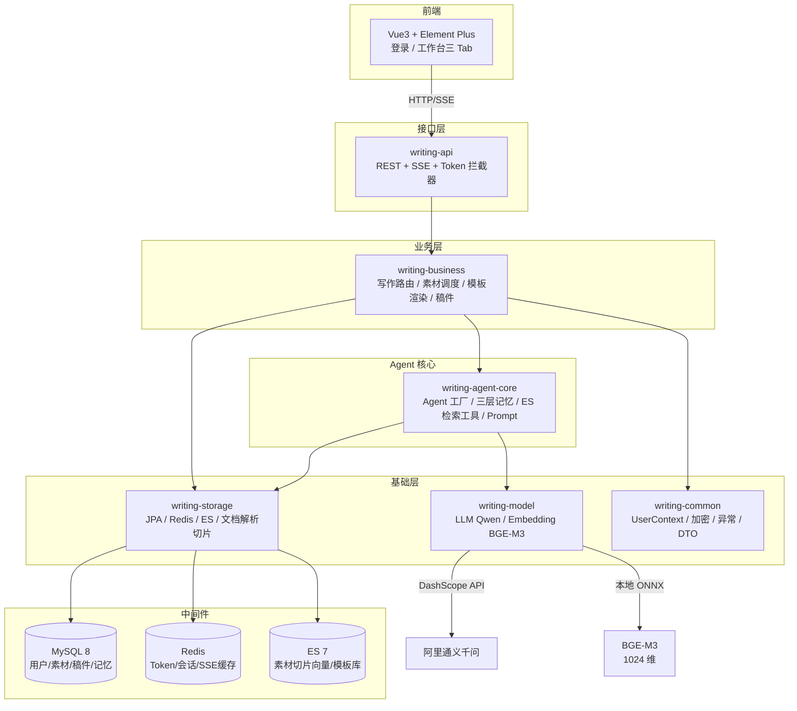

# ScriptAgent · 智稿引擎

> **企业级 AI 写作中台 · Java 21 + Spring Boot 3 + AgentScope 2.0**
>
> 一套部署在内网、可自托管、多租户隔离的通用智能写作系统——把"一句话想法"变成"成稿"，把"素材文档"变成"仿写稿"，把"模板填空"变成"标准化报告"。


---

## 🎬 效果演示

**完整操作视频**：[`docs/操作视频.mov`](docs/操作视频.mov)（约 19MB，点击下载后本地播放）

视频覆盖：登录 → 上传素材 → 一句话写作 / 素材仿写 / 模板写作三种模式 → SSE 流式输出 → 稿件导出。

---

## ✨ 核心能力

| 模式 | 输入 | 输出 | 关键技术 |
|------|------|------|---------|
| **💬 一句话写作** | 一句话需求（多轮对话迭代） | 结构化成稿 | 短期记忆 + SSE 流式 + Prompt 工程 |
| **📄 素材仿写** | 上传 docx / pdf / txt / md 文档 + 写作要求 | 风格一致的仿写稿 | POI/PDFBox 解析 → 512 字切片 → BGE-M3 本地向量化 → ES 语义检索注入 |
| **📋 模板写作** | 选模板 + 填动态表单 | 标准化报告 | 模板 structure + variables 驱动前端表单，占位符 `${变量名}` 渲染 |

**设计原则**：
- 🔒 **多租户隔离**：所有数据查询强制 `user_id`，前端传参一律不信任，从 Token 解析
- 🧠 **三层记忆**：短期（Redis，最近 10 轮对话）/ 长期（MySQL，用户偏好回写）/ 核心（系统 Prompt）
- 🔌 **模型可替换**：LLM 走阿里通义千问 DashScope，Embedding 走本地 BGE-M3（ONNX Runtime 进程内推理，1024 维），不绑死任何供应商
- 🚫 **不引入 Spring Security**：手写 BCrypt + UUID Token + 拦截器，零黑盒、零多余依赖

---

## 🏗️ 系统架构



---

## 🧩 模块结构（Maven 多模块，单向依赖无循环）

```
wordpilot/
├── writing-start        # 启动聚合：主类、依赖聚合、fat JAR
├── writing-api          # 接口层：登录、素材、三类写作、模板、稿件；Token 拦截器
├── writing-business      # 业务编排：写作路由、素材调度、模板渲染、稿件历史
├── writing-agent-core   # Agent 核心：Agent 工厂、三层记忆、ESRetrieveTool、Prompt、SSE
├── writing-storage      # 存储层：JPA Entity/Repository、Redis、文档解析、切片、ES 索引
├── writing-model         # 模型服务：LLM（Qwen/DashScope）、Embedding（BGE-M3 本地 ONNX）
└── writing-common       # 公共基础：工具类、BCrypt、UserContext、异常、常量、DTO
```

**依赖方向**：`writing-start → writing-api → writing-business → {writing-agent-core, writing-storage, writing-model, writing-common}`

---

## 🚀 快速开始

### 前置条件

| 软件 | 版本 |
|------|------|
| JDK | 21 |
| Maven | 3.9+ |
| MySQL | 8.x (3306) |
| Redis | 7.x (6379) |
| Elasticsearch | 7.17.x (9200) |
| 前端（可选） | Node 18+ |

### 1. 配置环境变量

复制 `.env.example` 为 `.env`（已 gitignore，不会提交）：

```bash
export MYSQL_HOST=127.0.0.1
export MYSQL_PORT=3306
export MYSQL_DB=wordpilot
export MYSQL_USER=root
export MYSQL_PASSWORD=your-password

export REDIS_HOST=127.0.0.1
export REDIS_PORT=6379
export ES_URIS=http://127.0.0.1:9200

# 阿里云 DashScope（通义千问）
export DASHSCOPE_API_KEY=sk-xxx

# 本地 BGE-M3 模型路径（目录内含 onnx/model.onnx）
export BGE_MODEL_PATH=/path/to/bge-m3
```

### 2. 启动中间件 + 后端

```bash
# 一键启动（含健康检查等待）
./start.sh
```

或手动：
```bash
mvn clean package -DskipTests
java -jar writing-start/target/wordpilot.jar
```

启动后访问：
- `http://localhost:8080/swagger-ui.html` —— API 文档
- `http://localhost:8080/actuator/health` —— 健康检查
- `http://localhost:8080/actuator/prometheus` —— Prometheus 指标

### 3. 启动前端（独立目录）

```bash
cd frontend
npm install
npm run dev
```

---

## 📚 设计文档

完整设计与开发讲义见 [`docs/`](docs/)：

| 文档 | 内容 |
|------|------|
| [IndustryResearch.md](docs/IndustryResearch.md) | 行业调研：AI 写作中台定位、竞品分析、技术选型 |
| [DemandAnalysis.md](docs/DemandAnalysis.md) | 需求分析：用户场景、功能边界、设计决议 |
| [TechnicalSolution.md](docs/TechnicalSolution.md) | 技术方案：架构、模块、数据流、关键设计点 |
| [AiProgrammingGuide.md](docs/AiProgrammingGuide.md) | AI 编程指南：规范、门禁、开发节奏 |
| [docs/class/](docs/class/) | 8 节功能原理解析与代码讲解（按开发顺序排列） |
| [docs/测试素材/](docs/测试素材/) | 4 种格式（docx/pdf/txt/md）的 RAG 测试素材 |

---

## ✅ 工程质量保障

| 层级 | 工具 | 职责 |
|------|------|------|
| 代码格式 | Spotless + google-java-format | 缩进 / import / 空白自动修 |
| 编码规约 | 阿里 P3C (PMD) | 命名 / 并发 / 异常 / OOP / SQL 规约 |
| 安全扫描 | SpotBugs + Find Security Bugs | OWASP Top 10 漏洞 |
| 依赖安全 | OWASP Dependency-Check | 第三方 CVE 阻断（CVSS ≥ 7） |
| Git 门禁 | pre-commit | 提交前自动跑格式 + 快速扫描 |

一键验证：
```bash
mvn verify    # 全量门禁
mvn spotless:apply  # 自动修格式
```

---

## 🗺️ 开发进度

按 SDD 五阶段 / 8 节讲义推进，当前状态：

- [x] **第 1 节** 存储层（JPA/Redis/ES 分层、逻辑删除、审计）
- [x] **第 2 节** 模型服务（Qwen 出口、BGE-M3 本地 ONNX 1024 维）
- [x] **第 3 节** 登录与鉴权（BCrypt + Token + 拦截器 + UserContext）
- [x] **第 4 节** 素材 RAG（POI/PDFBox 解析、512 字切片、ES 向量检索）
- [x] **第 5 节** Agent 核心与三层记忆（Redis/MySQL/Prompt）
- [x] **第 6 节** 模板引擎（structure + variables 动态表单）
- [x] **第 7 节** 前端工作台（Vue3 三 Tab、SSE 流式）
- [x] **第 8 节** 三类写作编排（一句话 / 素材仿写 / 模板写作全链路联调）

---

## 📄 License

Apache License 2.0
