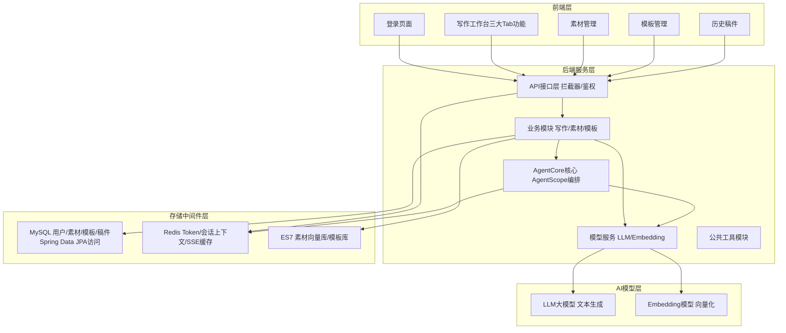

# ScriptAgent 智稿引擎 技术方案

本文档定义 ScriptAgent 智稿引擎的技术方案，回答 How 的问题。前置阅读《ScriptAgent 智稿引擎 行业调研》《ScriptAgent 智稿引擎 需求文档》和《ScriptAgent 智稿引擎 - 完整系统架构设计文档（SDD 版）》。本文档以需求文档定义的三类核心写作能力（一句话多轮对话写作、素材文档仿写 RAG、固定模板写作）和四类支撑能力（登录鉴权、素材管理、模板管理、稿件历史）为骨架展开，每个模块只给职责和功能说明，不展开代码细节。代码层面的实现细节在研发阶段补充。

> 承接 SDD 的定位判断：Agent 无状态、会话放 Redis、素材检索放 ES、用户数据完全隔离、轻量易部署、适配 SDD 迭代开发。本技术方案覆盖 SDD 五阶段全部范围，并在架构上为扩展功能（开放 API、SSO、模型多路切换、素材权限分级）预留扩展点。
> **文档结构提示：**
>
>  全文分两部分。第一部分（第 1-10 章）是
>
> **底座**
>
> —— 让三类写作能力可靠运行的引擎、能力与支撑设施。第二部分（第 11-14 章）是整合验证、实施节奏和收尾。


***

# 第一部分：底座

## 1. 方案概述

ScriptAgent 是一个 **SpringBoot3.x 单体应用**，跑在 **JDK 21** 上，基于 **AgentScope2.0** 做 Agent 底座（Agent 管理、工具调用、记忆管理），**Spring Data JPA** 做数据访问，**Redis4** 管 Token / 会话 / 限流，**ES7** 管素材向量检索，**MySQL8** 管业务数据，前端 **Vue3 + Vite + Element Plus** 单页工作台，**SSE** 流式输出。整体是一个可执行 JAR，Maven 7 模块单向依赖，一条命令打包运行。

> **技术栈选型一句话总结**
>
> ：SpringBoot3.x + Java21 + Spring Data JPA + AgentScope2.0 + Redis4 + ES7 + MySQL8 + POI/PDFBox + Vue3/Element Plus/Pinia + SSE。

### 1.1 关键技术决策

先统一列出 8 个关键决策的取舍，用一张表速览，再逐条展开。


| # | 决策                     | 选择                                                                                                  | 理由                                                                    |
| - | ---------------------- | --------------------------------------------------------------------------------------------------- | --------------------------------------------------------------------- |
| 1 | Agent 状态模型             | **Agent 无状态，状态外置**（会话→Redis、素材向量→ES、业务数据→MySQL）                                                     | 天然支持扩展；Agent 工厂按需生成，不持有会话状态                                           |
| 2 | AgentScope 使用边界        | 用 Agent 管理、工具调用、记忆管理抽象；**短期会话记忆对接 Redis、长期记忆对接 MySQL、检索工具对接 ES**                                    | 复用 AgentScope 能力，但存储走项目自己的 Redis/MySQL/ES，不引入其默认存储                    |
| 3 | 登录鉴权                   | 手写极简登录（BCrypt + UUID Token + Redis），**不用 SpringSecurity**                                           | 单表用户、够用且安全、轻量易维护；扩展阶段可平滑升级 SSO                                        |
| 4 | ORM 与数据访问              | Spring Data JPA，Entity/Repository 集中 **writing-storage**，查询强制 user\_id，`@SQLDelete` + `@Where` 逻辑删除 | 注解式实体 + Repository 接口，CRUD / 分页 / 审计零手写 SQL，数据隔离硬约束                   |
| 5 | RAG 管线自实现              | POI + PDFBox 解析 → 固定长度 + 重叠切片 → Embedding 向量化 → ES7 批量入库 → 用户维度检索                                   | 管线各环节成熟组件，组合简单可控；切片参数可配置调优                                            |
| 6 | 流式输出                   | SSE（Spring MVC 异步 / SseEmitter），Redis 缓存流式内容                                                        | 长文生成体验关键能力，前端实时渲染增量                                                   |
| 7 | 存储分层                   | MySQL 业务数据 / Redis 会话与 Token / ES 向量与模板检索，各司其职                                                      | 存储选型贴合数据访问模式：关系型、KV、向量检索各有成熟方案                                        |
| 8 | 模块组织                   | Maven 7 模块**单向依赖、无循环依赖**                                                                            | 适配 SDD 模块化开发，每阶段可独立交付与验证                                              |
| 9 | **AgentCore 与模型服务的关系** | AgentCore（AgentScope 编排）**依赖**模型服务（writing-model）；LLM/Embedding 调用统一经模型服务发出，AgentCore 不直接连接模型       | 模型服务是 LLM/Embedding 的唯一出口，换模型只改模型服务层；"做什么"（Agent 编排）与 "怎么调"（模型调用）职责分离 |

**决策一：Agent 无状态，状态外置。** 这是整个系统的核心设计。写作 Agent 由 Agent 工厂按写作模式（对话 / 仿写 / 模板）生成，不持有任何会话状态。多轮对话上下文在 Redis（RedisMemory），素材向量在 ES（ESRetrieveTool），业务数据在 MySQL。任意时刻生成一个新的 Agent 实例都能继续处理用户的对话，因为没有状态在 Agent 内部。这个设计天然为多实例扩展留好路。

**决策二：AgentScope 的使用边界。** AgentScope2.0 提供 Agent 管理、工具调用、记忆管理等抽象，是系统 AI 能力的底座。ScriptAgent 在几个点上与 AgentScope 对接：Agent 工厂（按模式生成 Agent）、自定义短期会话记忆 RedisMemory（对接 Redis）、长期记忆（对接 MySQL writing\_memory）、自定义检索工具 ESRetrieveTool（对接 ES）。记忆的存储实现（短期 Redis、长期 MySQL）和检索的实现（ES）都落在项目自己的存储上，不引入 AgentScope 默认的存储方案，保证存储分层清晰、运维简单。

**决策三：极简登录，不用 SpringSecurity。** 单表用户（sys\_user）、BCrypt 加密、UUID Token 存 Redis、全局拦截器校验。对内部写作中台，这个方案把 "登录、鉴权、用户隔离" 三件事做到够用且安全，省掉 SpringSecurity 的配置复杂度。扩展阶段需要 SSO 时再引入 OAuth2/SAML 适配，不影响现有 Token 体系。

**决策四：Spring Data JPA 加集中式数据访问。** Entity 实体与 Repository 接口统一放 writing-storage 模块；审计注解 `@CreatedDate` 自动填充 create\_time（审计配置放 writing-common）；逻辑删除用 JPA 规范 `@SQLDelete` + `@Where`；分页用 JPA 自带 Pageable；**所有业务查询强制携带 user\_id**（JPQL/JpaSpecification 追加 user\_id 条件，Service 层统一控制），这是数据隔离的硬约束。开发环境 ddl-auto=update 自动建表，生产环境关闭自动建表、手动执行 SQL 脚本。

**决策五：RAG 管线自实现。** 素材仿写是 RAG 的标准应用：解析（POI 处理 docx、PDFBox 处理 pdf、txt/md 直接读）→ 切片（固定长度 + 重叠）→ 向量化（Embedding 模型）→ ES7 批量写入（索引 writing\_material\_chunk）→ 检索（按用户 + 语义相似度）。每个环节都是成熟组件，组合逻辑简单可控，切片参数（长度 / 重叠）可配置，便于调优召回质量。

**决策六：SSE 流式输出。** 三类写作的生成过程均通过 SSE 流式返回，前端实时渲染增量内容。流式过程数据缓存 Redis，支持断线恢复。这是长文生成体验的关键，也是前端工作台的交互底座。

**决策七：存储分层。** MySQL 管业务数据（用户、素材主表、稿件），Redis 管 KV 类状态（Token、会话上下文、SSE 缓存、限流），ES 管向量检索（素材切片）与模板库。数据访问模式决定存储选型，各层之间不越界。

**决策八：Maven 7 模块单向依赖。** writing-start（启动聚合）→ writing-api（接口）→ writing-business（业务编排）→ writing-agent-core（Agent 底座）/writing-storage（存储）/writing-model（模型服务）/writing-common（公共基础）。单向依赖、无循环依赖，适配 SDD 模块化开发，每阶段可独立交付与验证。

**决策九：AgentCore 依赖模型服务，LLM 统一经模型服务出口。** AgentCore（AgentScope 编排）负责 "做什么"——Agent 工厂、记忆、工具、Prompt 管理、流式封装；模型服务（writing-model）负责 "怎么调"——LLM 对话调用、Embedding 向量化、模型适配。AgentCore 在推理时不直接连接任何大模型，统一调用模型服务的 LLM 接口；素材 RAG 管线的向量化也由业务编排经模型服务调用。这个依赖让 "换模型只改模型服务层、Agent 层与业务层无感"，是模型可切换的基础。写作路由依赖表中 "LLM" 一项统一指 "模型服务的 LLM 对话调用"。

### 1.2 整体技术栈


1. **SpringBoot3.x + Java21**（核心框架，虚拟线程可选项）

2. **Spring Data JPA（Hibernate）**（ORM，MySQL 实体映射、CRUD、分页、逻辑删除、自动建表）

3. **AgentScope2.0**（Agent 管理、工具调用、记忆管理）

4. **Redis4**（Token 登录、用户会话、SSE 缓存、限流）

5. **ES7**（素材向量库、模板库、RAG 检索）

6. **MySQL8**（用户、素材、模板、稿件数据）

7. **POI + PDFBox**（docx、pdf、txt、md 文档解析）

8. **BCrypt**（密码加密，手写极简登录）

9. **Vue3 + Vite + Element Plus + Pinia + Axios**（前端工作台，SSE 流式渲染）


***

## 2. 整体架构

ScriptAgent 采用四层架构：**前端展示层 → 后端业务服务层 → 中间件存储层 → AI 模型层**，完全解耦、单向依赖。




### 2.1 分层视图


1. **前端展示层**：登录页、写作工作台（三大 Tab）、素材管理、模板管理、稿件历史。负责交互与展示，通过 Axios 调用后端 API，通过 SSE 接收流式内容。

2. **后端业务服务层**：API 接口层（拦截器 / 鉴权）、业务模块（写作 / 素材 / 模板 / 稿件）、AgentCore（AgentScope 编排）、模型服务（LLM/Embedding）、公共工具模块。负责业务逻辑编排与 AI 能力封装。

3. **中间件存储层**：MySQL（Spring Data JPA 访问）、Redis（Token / 会话 / SSE 缓存）、ES7（素材向量库 / 模板库）。负责状态与数据存储。

4. **AI 模型层**：LLM 大模型（文本生成）、Embedding 模型（向量化）。位于应用边界之外，**统一通过模型服务层调用**。

**AgentCore 与模型服务的关系（关键）**：AgentCore（AgentScope 编排）**依赖**模型服务模块，LLM/Embedding 的调用全部经模型服务层（writing-model）发出，AgentCore 不直接连接任何大模型。模型服务是 Agent 侧 LLM/Embedding 能力的唯一出口，同时素材 RAG 管线的向量化（Embedding）也由业务编排经模型服务调用。换模型只改模型服务层，AgentCore 与业务层不受影响。

### 2.2 三类写作能力与底座的关系

三类写作能力不是三个独立系统，它们共享同一套底座：


* **对话写作**：依赖 Agent 底座（AgentCore）+ 短期 / 长期记忆 + 模型服务（LLM），不需要 ES 检索

* **素材仿写**：依赖 Agent 底座（AgentCore）+ 记忆 + ESRetrieveTool（ES 检索）+ 模型服务（LLM + Embedding）

* **模板写作**：依赖 Agent 底座（AgentCore）+ ES 模板库 + 模型服务（LLM），不需要素材检索

> **简化成一句话**
>
> ：一套 Agent 底座（Agent 工厂 + RedisMemory + ESRetrieveTool + Prompt 管理）支撑三种写作模式，底座之上统一经
>
> **模型服务层**
>
> 调用 LLM/Embedding，一套存储（MySQL/Redis/ES）支撑所有写作场景。


***

## 3. 用户与鉴权模块

### 3.1 登录业务（writing-business）


* 账号查询：按用户名从 MySQL sys\_user 查询（JPA Repository）

* 密码比对：BCrypt 比对

* Token 签发：校验成功生成 UUID Token，写入 Redis（`token:{token}` → UserId），设置过期时间

* 返回 Token 给前端

### 3.2 鉴权拦截器（writing-api）


* 全局 Token 拦截器：所有业务请求先校验 Header 中的 Token

* 校验通过：从 Redis 解析出用户，写入 UserContext（writing-common 提供）

* 校验失败 / 未携带：返回未授权，拦截请求

* 实现全局用户隔离：后续所有 Service 层查询从 UserContext 取用户

### 3.3 关键设计点


* **无 SpringSecurity**：拦截器 + UserContext 是最简鉴权方案，够用且轻量

* **Token 无状态可失效**：Token 只存 Redis，服务重启 / 手动删除即可全局失效

* **UserContext 贯穿**：所有业务查询的 user\_id 来源，禁止从请求参数取 user\_id（防越权）


***

## 4. 写作业务编排（writing-business）

写作业务是核心编排层，不碰底层存储、不碰 Agent 底层，只做路由与协调。

### 4.1 写作路由

`WritingService` 按用户选择路由到三种写作模式：


| 模式   | 入口             | 依赖                                                                |
| ---- | -------------- | ----------------------------------------------------------------- |
| 对话写作 | Tab1 一句话输入     | AgentCore 对话 Agent + 记忆（短期 / 长期 / 核心）+ 模型服务（LLM）                  |
| 素材仿写 | Tab2 素材 + 需求输入 | AgentCore 仿写 Agent + 记忆（短期 / 长期 / 核心）+ ESRetrieveTool + 模型服务（LLM） |
| 模板写作 | Tab3 模板 + 参数   | AgentCore 模板 Agent + 记忆（短期 / 长期 / 核心）+ ES 模板库 + 模型服务（LLM）         |

### 4.2 素材业务


* 文件解析调度：调用解析组件（POI/PDFBox），解析失败给明确提示

* 切片管理：调用切片工具类，生成切片列表

* ES 入库调度：调 Embedding 向量化 + ES 批量写入

* 素材删除：删除 MySQL 主记录 + 同步清理 ES 切片数据

### 4.3 模板业务


* 模板渲染：读取模板配置（结构 + 变量）

* 变量填充：用用户提交的参数填充模板占位符

* Prompt 组装：模板文本 + 参数 → 模板写作 Prompt

### 4.4 稿件历史业务


* 保存用户生成记录（三类写作统一入口）

* 稿件查询（分页、仅当前用户）

* 重新编辑（把历史稿件作为上下文继续迭代）

* 导出 Word（POI 生成 docx）


***

## 5. Agent 核心模块（writing-agent-core，核心重点）

职责：全权封装 AgentScope2.0，是系统的 AI 能力底座。

### 5.1 模块组成

**Agent 工厂（AgentFactory）。** 根据写作模式生成不同配置的写作 Agent：


| 模式   | Agent 配置                                             |
| ---- | ---------------------------------------------------- |
| 对话写作 | 对话 Prompt + RedisMemory + 模型服务（LLM），无检索工具            |
| 素材仿写 | 仿写 Prompt + RedisMemory + ESRetrieveTool + 模型服务（LLM） |
| 模板写作 | 模板 Prompt + RedisMemory + 模型服务（LLM）（模板内容来自 ES 模板库）   |

Agent 无状态：每次请求按需生成或复用工厂实例，不持有会话状态。

> **LLM 调用出口**
>
> ：Agent 工厂生成的 Agent 在推理时
>
> **不直接连接大模型**
>
> ，统一通过模型服务层（writing-model，见第 9 章）的 LLM 对话调用接口发出请求。这样换模型、加 fallback 只改模型服务层，Agent 层不感知具体模型。

**RedisMemory（自定义会话记忆）。** 对接 AgentScope 的记忆管理抽象，把会话记忆落到 Redis：


* 多轮对话上下文按 `session:{userId}:{sessionId}` 存储

* 支持追加、读取、TTL 过期

* 三类写作共享同一套会话记忆机制

**ESRetrieveTool（自定义 RAG 检索工具）。** 对接 AgentScope 的工具调用抽象，封装 ES 检索：


* 按用户 ID + 语义相似度在 writing\_material\_chunk 索引检索

* 返回 TopN 相似切片（文本），作为参考素材注入提示词

* 检索强制带 user\_id，保证只召回当前用户的素材

**Prompt 管理。** 三类写作场景 Prompt 隔离：


* 对话写作 Prompt：身份 + 用户需求 + 对话历史

* 仿写写作 Prompt：身份 + 参考素材 + 用户需求 + 对话历史

* 模板写作 Prompt：身份 + 模板文本 + 参数 + 对话历史

**多轮对话管理与流式输出封装。** 把 AgentScope 的生成结果封装为 SSE 流式输出，逐段推送前端，同时写 Redis 会话缓存。

### 5.2 记忆分层设计（短期 / 长期 / 核心）

记忆是写作 Agent 的核心能力，分三层，与 AgentScope 的记忆机制（`MemoryBase` 短期记忆、`LongTermMemoryBase` 长期记忆、AutoContextMemory 上下文压缩）对齐，存储落在项目自己的 Redis / MySQL 上：


| 层                       | 对应 AgentScope                    | 存什么                            | 存哪里                                     | 生命周期                 | 注入时机                            |
| ----------------------- | -------------------------------- | ------------------------------ | --------------------------------------- | -------------------- | ------------------------------- |
| **短期记忆（会话记忆）**          | `MemoryBase`（RedisMemory 自定义实现）  | 当前一次多轮对话的完整历史                  | Redis `session:{userId}:{sessionId}`    | 随会话，TTL 过期           | 每轮 LLM 调用注入（最近 N 轮）             |
| **长期记忆（用户偏好记忆）**        | `LongTermMemoryBase`（写回 + 注入中间件） | 跨会话的用户写作偏好、风格、常用术语             | MySQL `writing_memory` 表（按 user\_id 隔离） | 跨会话持久，随用户删除          | 每次对话开始注入 system prompt          |
| **核心记忆（Agent 身份与任务定义）** | 系统提示词 / Prompt 管理（非运行期记忆）        | Agent 身份、三类写作任务定义、Prompt 骨架、约束 | 代码 / 配置（writing-agent-core 的 Prompt 管理） | 只随代码 / 配置变更，永不因对话被截断 | 每次 LLM 调用固定注入 system prompt 最前面 |

#### 短期记忆（会话记忆）


* 一次多轮对话的上下文容器，按 `session:{userId}:{sessionId}` 存 Redis（RedisMemory，对接 AgentScope `MemoryBase`）

* 支持追加（每轮）、读取（组装 prompt）、TTL 过期（会话级清理）

* 三类写作共享同一套会话记忆机制

**内容构成：只存 "对话层消息"。** 每条记录只有两个来源 ——`user` 的输入 和 `assistant` 的最终回复。Redis 中存的是一段 `[{role, content}...]` 的对话层消息数组：


```
[
  { "role": "user",      "content": "帮我写一篇新品推文" },
  { "role": "assistant", "content": "好的，初稿如下：……" },
  { "role": "user",      "content": "开头再活泼一点" },
  { "role": "assistant", "content": "已调整：……" }
]
```

**明确丢弃的中间态（不写入短期记忆）**：


* Agent 的思考过程（think /plan/reasoning）

* tool 调用记录与 tool 执行输出（如 ESRetrieveTool 检索到的参考素材片段）

* 每次推理产生的内部中间消息

**窗口策略：默认保留最近 10 轮，可配置。** 轮数窗口设为 yml 配置项（`memory.short-term.max-rounds`，默认 10）；超过窗口的最早轮次被滑出。若单轮内容很大、10 轮累计 token 仍超模型上下文阈值，由 AutoContextMemory（见下）把更早对话蒸馏成摘要兜底。

**工具输出不持久化，靠 "每轮重注入"**：仿写 / 模板写作时，ESRetrieveTool 检索到的参考素材、模板参数属于本轮工具输入输出，不写入短期记忆；下一轮迭代需要时由业务编排层在组装本轮 Prompt 时重新检索、重新注入（无状态工具可随时重调），不依赖历史 tool 中间态。

**与长期记忆的分工**：短期记忆窗口滑出后会丢信息，因此**跨轮需要长期保持的指令（如 "以后都写 800 字"）必须走&#x20;**`save_memory`**&#x20;进长期记忆**（见下），不能指望短期记忆窗口一直保留。

#### 长期记忆（用户偏好记忆）


* 跨会话记住用户稳定偏好（如 "我喜欢简洁风格"" 我常用 XX 术语 ""我习惯先给大纲再展开"），让 AI 越用越懂用户

* 存储：MySQL 新增 `writing_memory` 表（`user_id` + `memory_type` + `content`），按用户隔离、查询强制 user\_id，跨会话持久

* 写入：Agent 在对话中识别到稳定偏好时，通过一个内置工具 `save_memory` 回写（对接 AgentScope `LongTermMemoryBase` 的写回机制）；Agent 不自作主张猜，系统不自动抽取

* 注入：每次对话开始时按 user\_id 加载长期记忆，注入 system prompt；量少时全量注入，量大时按最新 / 高频截断

* 容量控制：按条数与总长度限制，超长截断或归档（扩展阶段可向量化到 ES 做语义召回）

#### 核心记忆（Agent 身份与任务定义）


* Agent 固定不变的 "人格 + 干什么"：三类写作 Agent 各自的系统指令（对话 / 仿写 / 模板的身份、职责、约束、Prompt 骨架）

* 本质是 Prompt 管理 + 固定注入，不是运行期可变记忆；永远排在 system prompt 最前面，不被压缩、不被截断

* 只随代码 / 配置变更而变，是三类写作差异化的来源

#### 上下文压缩（AutoContextMemory）


* 当短期记忆（对话历史）token 数超过模型上下文窗口阈值时，用 LLM 把早期对话蒸馏成摘要，只保留最近几轮完整对话

* **压缩前先把值得长期记住的事实写入长期记忆**（AgentScope 官方强调的顺序：先抽取长期记忆，再压缩短期记忆），保证有价值信息不因压缩丢失

* 完整原始对话可归档到 MySQL / 文件，供审计追溯（扩展阶段）

* 核心阶段可先做 "简单截断"（保留最近 N 轮），LLM 摘要压缩放扩展阶段

> **一句话**
>
> ：核心记忆定 "你是谁"，长期记忆记 "用户是谁"，短期记忆装 "这次聊了什么"，压缩保证 "聊得再长也不撑爆上下文"。

### 5.3 关键设计点


* **一套底座三种模式**：Agent 工厂按模式生成不同配置，底座能力（记忆、工具、Prompt 管理）完全复用

* **状态外置**：Agent 不持有状态，会话在 Redis、素材在 ES，无状态可扩展

* **工具可扩展**：ESRetrieveTool 是第一个自定义工具，未来加新工具（如模板检索工具、文档预览工具）走同一套抽象

* **流式输出统一**：三类写作的 SSE 封装走同一套代码


***

## 6. 素材 RAG 管线

### 6.1 管线步骤


```
上传文件 → 格式/大小校验 → 解析纯文本 → 智能切片 → Embedding 向量化 → ES 批量入库 → MySQL 素材主记录
```

### 6.2 模块组成

**文档解析（writing-storage）。** POI 解析 docx、PDFBox 解析 pdf、txt/md 直接读取，输出纯文本。解析失败返回明确错误，不产生半成品数据。

**切片工具类（writing-storage）。** 文本智能切片：


* 固定长度（默认可配置，如 512 字）+ 重叠（默认可配置，如 50 字）

* 保证切片间上下文衔接，避免语义断裂

* 输出切片列表（文本 + 序号）

**向量化（writing-model）。** 调用 Embedding 模型，把每个切片映射为向量。

**ES 入库与检索（writing-storage）。** 索引 writing\_material\_chunk：


* 批量写入：切片文本 + 向量 + 用户维度 + 素材关联

* 检索：按用户 + 语义相似度查询，返回 TopN

* 删除：按 material\_id 清理切片

### 6.3 关键设计点


* **用户维度贯穿**：切片文档携带 user\_id，检索强制带 user\_id

* **切片参数可配置**：长度 / 重叠可在 yml 配置，便于召回质量调优

* **入库失败可回退**：任一步骤失败，整体报错，不产生孤儿数据


***

## 7. 模板引擎

### 7.1 模板存储（ES 模板库）

模板配置存 ES7（模板索引），一条模板是一个 JSON 文档，包含以下字段：


| 字段                          | 说明                                                                                                           |
| --------------------------- | ------------------------------------------------------------------------------------------------------------ |
| id / user\_id               | 模板 ID、归属用户（按用户隔离）                                                                                            |
| name                        | 模板名称（如 "周报模板"）                                                                                               |
| description                 | 模板用途说明                                                                                                       |
| structure                   | **模板正文结构**：静态文本 + 变量占位符（`${变量名}`），是给 LLM 的格式骨架                                                               |
| variables                   | **变量配置数组**：每个变量的 key、label（表单文案）、type（text/textarea/select/number）、required、placeholder、options，**驱动前端动态表单** |
| prompt                      | 可选的额外写作要求 / 规范说明（注入 Prompt）                                                                                  |
| status                      | 启用 / 停用                                                                                                      |
| create\_time / update\_time | 创建、更新时间                                                                                                      |

**一个完整模板长这样**（以 "周报模板" 为例，字段即 ES 文档内容）：


```
{
  "id": "tpl-weekly-001",
  "user_id": 1,
  "name": "周报模板",
  "description": "标准周报，用于员工每周向直属上级汇报",
  "structure": "请按以下结构生成一份周报：\n标题：${title}\n\n【本周工作】\n${week_work}\n\n【下周计划】\n${next_plan}\n\n【风险与求助】\n${risk}\n",
  "variables": [
    { "key": "title",     "label": "周报标题",   "type": "text",     "placeholder": "如：市场部张三 2026年第1周周报", "required": true },
    { "key": "week_work", "label": "本周工作",   "type": "textarea", "placeholder": "逐条列出本周完成的工作",            "required": true },
    { "key": "next_plan", "label": "下周计划",   "type": "textarea", "placeholder": "逐条列出下周计划",                    "required": true },
    { "key": "risk",      "label": "风险与求助", "type": "textarea", "placeholder": "没有可填'无'",                        "required": false }
  ],
  "prompt": "生成一份语言简洁、条理清晰、面向直属上级汇报的标准周报。",
  "status": "enabled"
}
```

### 7.2 模板渲染（writing-business）


1. 前端读取模板的 `variables` → 动态生成表单（标题输入框 + 三个多行文本框）

2. 用户填参数提交

3. 后端读取 ES 模板配置，用用户参数替换 `structure` 中的 `${变量名}` 占位符

4. 组装模板写作 Prompt（核心记忆身份 + 模板正文 + `prompt` 规范说明 + 用户需求）

5. 调模型服务（LLM）生成规范文稿，落稿件历史

**组装后的 Prompt 示意**：


```
你是一个专业写作助手，负责按模板生成规范文稿。

请按以下结构生成一份周报：
标题：市场部张三 2026年第1周周报

【本周工作】
1. 完成新品上线的市场推广方案
2. 协调 3 家供应商报价

【下周计划】
1. 落地推广方案执行
2. 准备季度复盘数据

【风险与求助】
无

生成一份语言简洁、条理清晰、面向直属上级汇报的标准周报。
```

### 7.3 关键设计点


* **变量配置驱动表单**：前端根据变量配置动态生成表单，后端不写死表单结构

* **模板库与素材库分离**：模板是结构资产（ES 模板索引），素材是内容资产（ES 素材索引），职责清晰

* **启用停用**：停用模板不可用于新写作，历史稿件不受影响

* **占位符语法统一**：`${变量名}` 与 variables 的 key 一一对应，渲染时校验必填项


***

## 8. 存储层（writing-storage）

职责：统一封装 Redis、ES、MySQL 数据访问层；JPA Entity、JPA Repository 全部放在此模块。

### 8.1 MySQL（Spring Data JPA）


* JPA 实体 Entity、Repository 接口（用户、素材、稿件、**长期记忆**）

* CRUD、分页查询、条件查询

* **查询强制携带 user\_id**（JPQL/JpaSpecification 追加条件，Service 层统一控制）

* JPA 逻辑删除：`@SQLDelete` + `@Where` 注解

* JPA 审计：`@CreatedDate` 自动填充 create\_time（审计配置在 writing-common）

**长期记忆表&#x20;**`writing_memory`（跨会话用户偏好，见 5.2 长期记忆）：


| 字段           | 类型       | 说明                             |
| ------------ | -------- | ------------------------------ |
| id           | BIGINT   | 主键，自增                          |
| user\_id     | BIGINT   | 归属用户，强制携带                      |
| memory\_type | VARCHAR  | 记忆类型（style /term/habit /other） |
| content      | TEXT     | 记忆内容（一条用户偏好 / 事实）              |
| source       | VARCHAR  | 来源（save\_memory 工具 / 会话压缩抽取）   |
| create\_time | DATETIME | 创建时间（审计自动填充）                   |
| update\_time | DATETIME | 更新时间                           |
| deleted      | TINYINT  | 逻辑删除标记                         |

### 8.2 Redis 操作


* Token 缓存（`token:{token}` → UserId）

* 用户会话（`session:{userId}:{sessionId}` → 对话历史）

* SSE 缓存（`sse:cache:{userId}:{sessionId}` → 流式内容）

* 限流（按用户 / 按接口的计数）

### 8.3 ES 操作


* 素材切片入库（writing\_material\_chunk）

* 向量检索（按用户 + 语义相似度）

* 模板检索（模板索引）

### 8.4 文档切片工具


* 文本分割、重叠切片（见第 6 章）


***

## 9. 模型服务（writing-model）

职责：解耦 LLM 与 Agent，统一模型调用。**它是 AgentCore 的底层依赖**：AgentCore（AgentScope 编排）在推理时通过本模块调用 LLM，素材 RAG 管线的向量化通过本模块调用 Embedding。模型服务是系统唯一接触 LLM/Embedding 的地方。

### 9.1 模块组成


* **LLM 对话调用**：封装文本生成调用，供 AgentCore 使用（Agent 推理、三类写作生成都经此出口）

* **Embedding 向量生成**：封装向量化调用，供 RAG 管线使用（素材切片向量化）

* **模型适配**：统一接口，未来可切换不同大模型（如对接 Spring AI Alibaba connector）

### 9.2 关键设计点


* **唯一出口**：模型服务层是唯一接触 LLM/Embedding 的地方，AgentCore 与业务层都不直接连模型，换模型不动 Agent 层

* **Agent 不感知模型**：AgentCore 只依赖模型服务抽象，不关心具体调用哪家模型

* **分层清晰**：AgentCore（做什么：编排、记忆、工具）与模型服务（怎么调：LLM/Embedding）职责分离，两个模块单向依赖（AgentCore → 模型服务）

* **配置集中**：模型服务地址、API key 集中在 yml 配置

### 9.3 模型选型建议（落地）

**LLM：阿里云百炼通义千问（Qwen 系列）。** 通过阿里云百炼（DashScope）API 调用，写作生成、多轮对话走通义千问大模型。Java 侧可直接用 Spring AI Alibaba connector 或 RestClient 封装 DashScope HTTP 接口。

**Embedding：BGE（智源开源向量模型，推荐 bge-m3），本地模型 + JVM 进程内推理（ONNX Runtime）。** 阿里云百炼**不托管 BGE**，也不部署独立 Embedding HTTP 服务 ——bge-m3 模型文件本地下载到指定目录（含官方 ONNX 导出 `onnx/model.onnx`），由 writing-model 在 **Java 进程内用 ONNX Runtime 加载推理**，输出 1024 维向量。推荐 **BAAI/bge-m3**：维度 1024、支持 100+ 语言、长文（8192 token）、中文效果好，且同时支持 dense + sparse + colbert（为扩展阶段混合检索预留）。若业务纯中文、想更轻量，可选 bge-large-zh-v1.5。

**两条独立调用链（关键）**：


| 能力             | 模型               | 调用方式                           | 数据   |
| -------------- | ---------------- | ------------------------------ | ---- |
| LLM（生成 / 多轮对话） | 阿里通义千问 Qwen      | 阿里云百炼 DashScope API            | 经阿里云 |
| Embedding（向量化） | BGE bge-m3（本地加载） | 本地模型 + JVM 进程内 ONNX Runtime 推理 | 不出内网 |

LLM 与 Embedding 互不依赖、独立调用，各自可切换：换 LLM 只改 LLM 调用实现，换 Embedding 只改向量化实现，互不影响。

**备选（可选）**：若不想维护本地模型、希望 Embedding 也走阿里同一平台，可用阿里云百炼 `text-embedding-v4`（Qwen3-Embedding，默认维度 1024、支持 100+ 语言），按量付费。取舍：BGE 本地加载 = 免费、数据完全不出内网、需下载并加载模型（占用应用内存）；阿里 text-embedding-v4 = 免本地模型、按量付费、数据经阿里。

**落地注意点**：


1. **维度一致性（关键）**：bge-m3 dense 向量维度固定 **1024**，ES 索引 `writing_material_chunk` 的 `embedding` 字段（dense\_vector）的 `dim` 必须设为 **1024**，否则入库 / 检索报错；检索距离用 cosine（与 bge 默认一致）

2. **本地加载**：bge-m3 模型目录含官方 ONNX 导出（`onnx/model.onnx` + `onnx/model.onnx_data`，内置 Transformer+Pooling+Normalize，输出即归一化 1024 维向量）；writing-model 在 JVM 内用 ONNX Runtime 加载推理，应用启动时加载一次（单例）；CPU 可推理（写作量级够用），大并发 / 大批量可考虑 GPU 或 ONNX 加速；数据完全不出内网

3. **可选增强**：扩展阶段加 bge-reranker 做 ReRank 重排序，配合混合检索提升召回质量


***

## 10. 前端架构（Vue3 工作台）

### 10.1 技术栈与整体结构

前端采用单页面 Tab 工作台（Vue3 + Vite + Element Plus + Pinia + Axios），减少跳转，适配写作场景。

### 10.2 页面模块


| 模块            | 说明                                                                                                      |
| ------------- | ------------------------------------------------------------------------------------------------------- |
| 登录模块          | 账号密码登录、获取 Token、本地存储、路由守卫拦截未登录用户                                                                        |
| 核心工作台（三大 Tab） | Tab1 一句话多轮写作：对话式输入、SSE 流式输出、多轮修改、风格调整；Tab2 素材仿写：上传文件 / 选择已有素材、自动 RAG 检索、智能仿写；Tab3 模板写作：选择模板、动态表单填参、一键生成 |
| 素材管理模块        | 素材上传、列表、预览、删除                                                                                           |
| 模板管理模块        | 模板新增、编辑、启用停用、变量配置                                                                                       |
| 稿件历史模块        | 写作记录、重新编辑、导出 Word、删除                                                                                    |

### 10.3 关键设计点


* **Axios 拦截器**：统一携带 Token，401 时跳转登录

* **SSE 流式渲染**：EventSource /fetch stream 接收增量内容，实时渲染

* **路由守卫**：未登录跳转登录页

* **Pinia 状态管理**：用户状态、工作台状态、SSE 状态


***

# 第二部分：整合与验证

## 11. 关键流程

### 流程一：登录鉴权（端到端）


```
前端提交账号密码
  → POST /api/auth/login
  → writing-api 拦截器放行登录接口
  → writing-business 按用户名查 sys_user（JPA Repository）
  → BCrypt 比对密码
  → 生成 UUID Token 写 Redis（token:{token} → UserId）
  → 返回 Token
  → 前端存 Token，后续请求 Header 携带
  → 拦截器校验 Token，写入 UserContext
```

### 流程二：素材上传入库（RAG 地基）


```
前端上传文件（pdf/docx/txt/md）
  → POST /api/material/upload
  → 校验格式、大小
  → POI/PDFBox 解析纯文本
  → 切片工具类生成切片（固定长度 + 重叠）
  → 模型服务调 Embedding 向量化
  → ES 批量写入 writing_material_chunk（携带 user_id/material_id）
  → JPA 写入 writing_material（关联 UserId）
  → 返回素材信息，前端素材列表刷新
```

### 流程三：素材仿写（核心 RAG 链路）


```
用户在 Tab2 选择素材、输入仿写需求
  → POST /api/writing/rag
  → writing-business 路由到仿写模式
  → AgentCore 生成仿写 Agent（RedisMemory + ESRetrieveTool）
  → AgentScope 调 ESRetrieveTool：按 user_id 检索相似切片 → 参考素材
  → 组装仿写 Prompt（参考素材 + 用户需求 + 对话历史）
  → 模型服务调 LLM 生成
  → SSE 流式返回前端，同时写 Redis 会话
  → 生成完成，JPA 保存稿件历史
```

### 流程四：一句话多轮对话写作


```
用户在 Tab1 输入一句话
  → POST /api/writing/dialog
  → writing-business 路由到对话模式
  → AgentCore 生成对话 Agent（RedisMemory）
  → 读 Redis 会话上下文 → 组装对话 Prompt → LLM 生成
  → SSE 流式返回，多轮上下文持续写 Redis 会话
  → 生成结果保存稿件历史
```

### 流程五：模板写作


```
用户在 Tab3 选模板、填参数提交
  → POST /api/writing/template
  → 读取 ES 模板配置
  → 动态填充参数
  → 组装模板写作 Prompt
  → AgentCore 生成模板 Agent → LLM 生成
  → SSE 流式返回
  → 结果 JPA 入库保存稿件
```


***

## 12. 实施节奏（SDD 五阶段）

实施按 SDD 开发优先级组织为 5 个阶段，每阶段有可交付成果。

### 第一阶段：基础底座


* Maven 多模块骨架（7 模块，单向依赖）

* 公共模块：工具类、加密工具、用户上下文、异常、常量、DTO、枚举、JPA 审计监听器

* JPA Entity / Repository：基础 CRUD、分页查询

* 极简登录：BCrypt 加密、Token 签发、拦截器

* Redis 配置、ES7 配置

**可演示**：项目可启动，登录跑通，Token 鉴权生效，数据库自动建表。

### 第二阶段：素材 RAG 底座


* 文件解析功能（pdf/docx/txt/md）

* 文本切片工具类

* ES 素材索引创建、向量入库、检索功能

* 前端素材上传、素材列表页面

**可演示**：上传文档后素材列表可见，ES 中可检索到切片。

### 第三阶段：Agent 核心能力


* AgentScope 集成配置

* 记忆分层：RedisMemory（短期会话记忆）+ 长期记忆（MySQL `writing_memory` 读写）+ 核心记忆（Prompt 管理固定注入）

* ES 检索自定义工具实现（ESRetrieveTool）

* 三类写作 Agent 逻辑开发

**可演示**：三种写作模式都能调用 LLM 产出文稿，SSE 流式输出。

### 第四阶段：前端业务页面


* 登录页面

* 三大写作 Tab 工作台

* 模板管理、稿件历史页面

**可演示**：完整前端工作台可用，三 Tab 全流程操作。

### 第五阶段：联调、优化、收尾


* 流式输出、异常处理、数据隔离、权限校验、BUG 修复

* 验证 JPA 查询强制携带 user\_id，防止越权

**可演示**：端到端全链路可用，越权访问被拦截，系统稳定。


***

## 13. 性能和可扩展性考虑

**单体无状态支撑扩展。** Agent 无状态 + 状态外置（Redis/ES/MySQL）是天然的水平扩展基础：未来多实例部署时，任意实例都能处理任意用户请求，会话 / 素材 / 稿件都在共享存储中。

**MySQL/JPA 层。** 分页查询用 JPA Pageable + 索引（user\_id、create\_time），素材 / 稿件列表查询可控；数据量增长后按 user\_id 分区或归档。

**Redis 层。** Token 与会话数据量小、TTL 可控；Redis 是成熟组件，可做主从 / 哨兵 / Cluster 演进。

**ES 层。** ES 天然支持集群（分片 + 副本），素材向量检索水平扩展无障碍；切片索引可加别名管理，支持重建。

**前端渲染。** SSE 流式渲染避免长文等待；稿件导出 Word 在服务端异步处理（POI），大稿不阻塞主流程。


***

## 14. 总结

ScriptAgent 技术方案核心：**SpringBoot3.x + Java21 单体应用**，基于 **AgentScope2.0** 做 Agent 底座，**Spring Data JPA** 做数据访问，**Redis4 / ES7 / MySQL8** 做分层存储，**Vue3 + Element Plus** 做前端工作台，**SSE** 流式输出。

方案围绕三类核心写作能力 + 四类支撑能力展开：


1. **一句话多轮对话写作**：对话 Agent + 记忆分层（短期 Redis / 长期 MySQL / 核心 Prompt）+ 模型服务（LLM），无需 ES

2. **素材文档仿写（RAG）**：解析 → 切片 → 向量化（Embedding 经模型服务）→ ES 入库 → 用户维度检索 → 参考素材注入生成

3. **固定模板写作**：ES 模板库 + 动态表单 + 模板渲染 + 模型服务（LLM）

4. **支撑能力**：极简登录（BCrypt + Token + 拦截器）、素材管理、模板管理、稿件历史（导出 Word）

**记忆分层设计**：短期记忆（会话历史，Redis）+ 长期记忆（用户偏好，MySQL `writing_memory`）+ 核心记忆（Agent 身份与任务定义，Prompt 管理固定注入），配 AutoContextMemory 上下文压缩，与 AgentScope 的 MemoryBase / LongTermMemoryBase / AutoContextMemory 机制对齐。

**九个关键技术决策**：Agent 无状态状态外置、AgentScope 使用边界（记忆 / 检索对接 Redis/ES）、极简登录不用 SpringSecurity、JPA 集中式数据访问强制 user\_id、RAG 管线自实现、SSE 流式输出、存储分层（MySQL/Redis/ES 各司其职）、Maven 7 模块单向依赖、**AgentCore 依赖模型服务（LLM/Embedding 统一经模型服务出口）**。

**实施节奏**：SDD 五阶段（基础底座 → 素材 RAG 底座 → Agent 核心能力 → 前端业务页面 → 联调优化收尾），每阶段有可交付成果，适配团队 SDD 迭代开发。

**承接定位**：Agent 无状态、会话放 Redis、素材检索放 ES、用户数据完全隔离、轻量易部署。架构上为扩展功能预留扩展点（开放 API、SSO、模型多路切换、素材权限分级、混合检索都有对应的预留位置）。

**核心理念**：一套 Agent 底座支撑三种写作模式，一套存储支撑所有写作场景，员工在一个工作台里写完今天所有要写的东西；素材、模板、稿件在系统内沉淀复用；数据完全留在企业内网、按用户隔离。