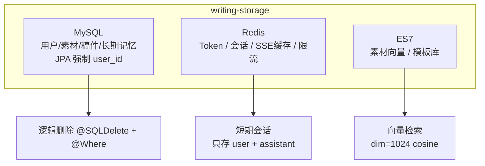

# 第1节：存储层 原理解析、实现与代码讲解

存储层模块（writing-storage）是 ScriptAgent 的数据地基，统一封装 MySQL / Redis / ES 三层存储。这节讲四件事：存储层是什么、动手前该想清楚什么、代码怎么写、做完怎么验。它落在决策四（Spring Data JPA 集中式数据访问）、决策七（存储分层）上。

---

## 一、存储层是什么，干嘛用的

一句话：把三种存储（MySQL 业务数据、Redis KV 状态、ES 向量/模板检索）的访问统一封装在一个模块里，别让上层到处碰数据。

通俗例子：一个"仓库总闸"。你要存单据（MySQL 业务数据）、放门禁卡（Redis 会话/Token）、翻档案柜按语义找资料（ES 向量检索），都从这个总闸进出，仓库里的架位怎么摆不用你操心。

在整套系统里，存储分层是决策七：**MySQL 管业务数据、Redis 管 KV 状态、ES 管向量与模板检索，各司其职、互不越界**。Entity/Repository 全集中在这，是 user_id 隔离的落点。

---



## 二、动手前先想清楚几件事

### 第一，三层存储各管什么

| 层    | 管什么                                                                                                           | 访问方式                     |
| ----- | ---------------------------------------------------------------------------------------------------------------- | ---------------------------- |
| MySQL | 用户`sys_user`、素材 `writing_material`、稿件 `writing_article`、**长期记忆 `writing_memory`**     | Spring Data JPA              |
| Redis | Token`token:{token}`、会话 `session:{userId}:{sessionId}`、SSE 缓存 `sse:cache:{userId}:{sessionId}`、限流 | RedisTemplate                |
| ES7   | 素材切片`writing_material_chunk`、模板库                                                                       | Java Client / Spring Data ES |

### 第二，为什么 Entity/Repository 全集中在这一个模块

因为**查询强制 user_id**（决策四）是数据隔离的硬约束。集中放，Service 层统一控制，不会散落在各个业务模块里偷偷写 JPQL 漏了 user_id。JPA 实体、Repository、审计监听器都在这。

### 第三，几个坑，提前想到

- **查询漏 user_id → 越权**。所有 JPQL/JpaSpecification 强制带 user_id，最易写错。
- **物理删除** → 稿件历史没了。用 `@SQLDelete` + `@Where` 逻辑删除。
- **审计字段手填** → 时间不统一。用 `@CreatedDate` 自动填充。
- **生产环境 ddl-auto=update** → 危险。生产关闭自动建表，手动 SQL。
- **删除素材不清 ES** → 孤儿向量。MySQL 删除要同步清 ES 切片。
- **短期记忆存中间态** → 冗余。Redis 会话只存 user + assistant 对话层。

---

## 三、代码怎么写

### 模块分工表

| 类                                                                      | 职责                                               |
| ----------------------------------------------------------------------- | -------------------------------------------------- |
| `*Entity`（sys_user/writing_material/writing_article/writing_memory） | JPA 实体                                           |
| `*Repository`                                                         | JPA Repository 接口                                |
| `RedisTemplate` 操作封装                                              | Token / 会话 / SSE 缓存                            |
| `MaterialChunkRepository` / `TemplateRepository`                    | ES 存取                                            |
| JPA 审计监听器                                                          | `@CreatedDate` 自动填充（配置在 writing-common） |

### 主角一：Entity + Repository（JPA 集中式）

```java
@Entity
@Table(name = "writing_memory")
@SQLDelete(sql = "UPDATE writing_memory SET deleted=1 WHERE id=?")   // 逻辑删除
@Where(clause = "deleted=0")                                          // 查询只回未删
public class WritingMemory {
    @Id @GeneratedValue(strategy = GenerationType.IDENTITY)
    private Long id;
    private Long userId;        // 强制携带
    private String memoryType;  // style / term / habit / other
    private String content;
    private String source;      // save_memory 工具 / 会话压缩抽取
    @CreatedDate private LocalDateTime createTime;  // 审计自动填充
    private LocalDateTime updateTime;
}
```

要点：`@SQLDelete` + `@Where` 实现逻辑删除——删除只是打标，历史还在；`@CreatedDate` 自动填 create_time，不手填。

### 主角二：查询强制 user_id（Service 层统一控制）

```java
public interface WritingMemoryRepository extends JpaRepository<WritingMemory, Long> {
    @Query("SELECT m FROM WritingMemory m WHERE m.userId = :userId AND m.deleted = false")
    List<WritingMemory> findByUser(@Param("userId") Long userId);
    // 所有业务查询 MUST 带 userId 条件，禁止不带条件查询
}
```

要点：**user_id 的唯一来源是 UserContext**（登录拦截器写入），不从前端参数取；这条是越权防护的地基。

### 配角：Redis 会话操作（短期记忆落点）

```java
public class RedisMemoryStore {
    private static final String SESSION_KEY = "session:{userId}:{sessionId}";
    // append(role, content)  追加对话层消息
    // loadRecent(maxRounds)  取最近 N 轮
    // expire(key, ttl)       会话级 TTL 清理
    // 只存 user + assistant 最终回复，丢弃 think/tool 中间态
}
```

### 配角：ES 素材检索（带 user_id）

```java
public List<String> search(Long userId, float[] queryVector, int topK) {
    // ES knn：must 加 user_id 条件 → 只召回当前用户切片；dim=1024，cosine
    // deleteByMaterialId(materialId)  删除素材时按 material_id 清理切片
}
```

---

## 四、验收 harness

| 测试类                          | 覆盖的验收点                                            |
| ------------------------------- | ------------------------------------------------------- |
| `WritingMemoryRepositoryTest` | 按 user_id 查、user_id 隔离；逻辑删除后查不到、历史保留 |
| `ArticleRepositoryTest`       | 分页仅当前用户；逻辑删除生效                            |
| `RedisMemoryStoreTest`        | 会话存取 + TTL；只存对话层、中间态不入                  |
| `MaterialChunkRepositoryTest` | ES 检索带 user_id；删除按 material_id 清干净            |
| `AuditTest`                   | `@CreatedDate` 自动填充 create_time，非手填           |

最值钱的回归测试：

```java
@Test
void findByUser_returnsOnlyOwnData_noCrossUser() {
    // 构造 userA、userB 各一条记忆
    assertEquals(1, repo.findByUser(userA).size());   // 只回自己的
    assertEquals(1, repo.findByUser(userB).size());
    // 漏 user_id 的查询必须不存在 → 无法越过隔离
}

@Test
void delete_logical_hiddenFromQuery_rowRetained() {
    memoryService.delete(userA, memoryId);
    assertTrue(repo.findByUser(userA).isEmpty());     // 查询回不到
    // 但物理行仍在（deleted=1），可审计可恢复
}
```

---

## 五、做完怎么验

harness 全绿后，人工确认：

1. 应用启动，`sys_user`/`writing_material`/`writing_article`/`writing_memory` 四表自动建好
2. 删除一条稿件，列表查不到，但数据库里行还在（deleted=1）
3. Redis 里会话只看到 user/assistant 消息，无中间态
4. ES 检索只回当前用户切片；删除素材后切片清空
