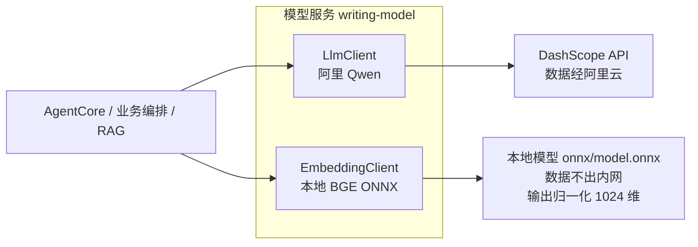

# 第2节：模型服务 原理解析、实现与代码讲解

模型服务模块（writing-model）是 ScriptAgent 里"唯一接触大模型的地方"。这节讲四件事：模型服务是什么、动手前该想清楚什么、代码怎么写、做完怎么验。它落在决策九（AgentCore 依赖模型服务）和 §9.3 模型选型上（LLM 阿里 Qwen + Embedding BGE bge-m3 本地加载）。

---

## 一、模型服务是什么，干嘛用的

一句话：把"调大模型"这件事统一收口——LLM 对话调用（阿里 Qwen）和 Embedding 向量化（本地 BGE）都经这里发出，AgentCore 和业务层不直连任何模型。

通俗例子：公司的"翻译官"办公室。全公司（Agent、业务）要跟外部（大模型）沟通，都得找它。它认识两家"外部伙伴"：Qwen 负责说话（生成）、BGE 负责翻译成向量（Embedding）。哪天想换一家伙伴，只换这间办公室的人，公司其他人照常办公。

在整套系统里，模型服务是 **AgentCore 的底层依赖**：Agent 推理、三类写作生成、素材 RAG 的向量化，全部经它。

---



## 二、动手前先想清楚几件事

### 第一，两条独立调用链

| 能力 | 模型 | 调用方式 | 数据 |
|------|------|---------|------|
| LLM（生成/多轮对话） | 阿里通义千问 Qwen | 阿里云百炼 DashScope API | 经阿里云 |
| Embedding（向量化） | BGE bge-m3（本地加载） | 本地模型 + JVM 进程内 ONNX Runtime 推理 | 不出内网 |

两条链互不依赖、各自可切换：换 LLM 只改 LLM 调用实现，换 Embedding 只改向量化实现，互不影响。

### 第二，为什么 LLM 和 Embedding 都要收口在这一个模块

因为 **Agent 不感知模型**。AgentCore 只依赖模型服务抽象，不关心具体调哪家。换模型只改模型服务层，Agent 层与业务层无感——这是模型可切换的基础（决策九）。

### 第三，几个坑，提前想到

- **AgentCore 直连大模型** → 换模型要改 Agent 层，违背唯一出口。
- **Embedding 走远程服务** → 增加部署成本，还可能数据出境。本方案是**本地模型 + JVM 进程内 ONNX Runtime**。
- **ES 索引维度与 bge-m3 不一致** → 入库检索报错。`dense_vector.dim` 必须 = 1024，距离用 cosine。
- **模型加载在每次调用时** → 2.3GB 模型反复加载，性能灾难。必须启动加载一次、单例复用。
- **API key 明文写进代码/yml** → 泄漏。一律 `${ENV_VAR}`。

---

## 三、代码怎么写

### 模块分工表

| 类 | 职责 |
|----|------|
| `LlmClient` | LLM 对话调用封装（阿里 Qwen / DashScope） |
| `EmbeddingClient` | Embedding 向量化（本地 BGE，ONNX Runtime） |
| `ModelService` | 统一门面，暴露 `chat()` 和 `embed()` |
| `ModelProperties` | 集中配置（模型名、API key、模型路径） |

### 主角：EmbeddingClient（本地加载，§9.3 核心）

```java
@Component
public class EmbeddingClient {
    @Value("${model.embedding.model-path}")
    private String modelPath;              // 本地 bge-m3 模型目录（含 onnx/model.onnx）

    private OrtSession session;
    private BertTokenizer tokenizer;

    @PostConstruct
    void load() {                          // load-on-start：启动加载一次，单例
        session = OrtEnvironment.getEnvironment()
                .createSession(modelPath + "/onnx/model.onnx",
                               new OrtSession.SessionOptions());
        tokenizer = BertTokenizer.fromPretrained(modelPath);
    }

    public float[] embed(String text) {
        // 1. tokenizer 编码 → 2. session.run 推理 → 3. 取输出向量
        // 模型内置 Transformer+Pooling+Normalize，输出即归一化 1024 维向量，可直接 cosine
        return output;
    }
}
```

要点：模型 ONNX 导出自带三件套（Transformer+Pooling+Normalize），**输出即归一化 1024 维向量**，无需二次处理；`@PostConstruct` 启动加载一次，CPU 可推理（写作量级够用），大批量可考虑 GPU/ONNX 加速。

### 主角二：LlmClient（LLM 对话，阿里 Qwen）

```java
@Component
public class LlmClient {
    @Value("${model.llm.api-key}")
    private String apiKey;                 // ${DASHSCOPE_API_KEY}，环境变量

    public String chat(List<Message> messages, ChatOptions options) {
        // 经阿里云百炼 DashScope API 调用通义千问
        // 可直接用 Spring AI Alibaba connector，或 RestClient 封装 HTTP 接口
    }
}
```

要点：LLM 走 DashScope API（数据经阿里云）；`api-key` 必须 `${ENV_VAR}`，不落库不落码。

### 门面：ModelService（统一出口）

```java
@Service
@RequiredArgsConstructor
public class ModelService {
    private final LlmClient llm;
    private final EmbeddingClient embedding;

    public String chat(List<Message> messages) { return llm.chat(messages, defaultOptions()); }
    public float[] embed(String text)        { return embedding.embed(text); }
}
```

AgentCore、写作编排、RAG 管线都只依赖 `ModelService`，**不直接拿 LlmClient/EmbeddingClient**——这就是唯一出口的落地。

---

## 四、验收 harness

| 测试类 | 覆盖的验收点 |
|--------|-------------|
| `EmbeddingClientTest` | 输出维度 = 1024；同文本输出稳定；归一化（模长≈1） |
| `LlmClientTest` | chat 走通（可 mock）；错误抛清晰异常 |
| `ModelServiceTest` | 门面正确委派；API key 从环境变量注入非明文 |
| `IndexDimensionTest` | ES `writing_material_chunk.embedding` 的 dim = 1024、检索 cosine |

最值钱的回归测试：

```java
@Test
void embed_alwaysReturnsDim1024_matchesEsIndex() {
    float[] vec = embeddingClient.embed("测试文本");
    assertEquals(1024, vec.length);        // 维度不一致 → 入库检索必炸
}

@Test
void apiKey_neverReadFromPlaintextConfig() {
    // 只允许 ${ENV_VAR} 占位，代码/yml 不含真实 key
    assertFalse(modelProperties.getApiKey().contains("sk-"));
}
```

---

## 五、做完怎么验

harness 全绿后，人工确认：

1. 应用启动，日志显示 Embedding 模型加载成功（单例，非每次调用加载）
2. 对一个文本向量化，确认维度 1024、可入 ES
3. 调 LLM 生成一段文字，SSE 正常返回
4. 改一个环境变量换模型，Agent 层代码不动，重启即生效
