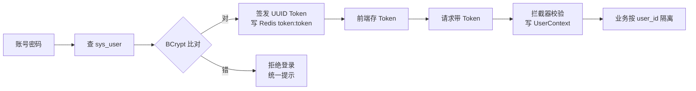

# 第3节：登录与鉴权 原理解析、实现与代码讲解

登录鉴权是 ScriptAgent 的第一块支撑能力，也是整个系统的第一道门。这节讲四件事：登录鉴权是什么、动手前该想清楚什么、代码怎么写、做完怎么验。它落在极简登录决策（决策三）上：**BCrypt + UUID Token + Redis，不用 SpringSecurity**。技术栈还是 JDK 21 + Spring Boot 3.x。

---

## 一、登录鉴权是什么，干嘛用的

一句话：让用户用账号密码进系统，之后每个请求都带上一个 Token，系统凭 Token 认出"你是谁"，并且只让你碰你自己的数据。

通俗例子：进大楼要刷门禁卡。第一次用账号密码办卡（登录拿 Token），之后每次进楼刷同一张卡（请求带 Token），门禁确认是你本人（拦截器校验），而且只有你办公室那层能进（user_id 隔离）。万一卡丢了，前台可以直接挂失让这张卡失效（删 Redis Token），不用换门锁。

在整套系统里，登录鉴权是**用户数据完全隔离**的前提——素材、会话、稿件、模板都要按 user_id 隔离，而 user_id 的来源就是这里签发的 Token。

---



## 二、动手前先想清楚几件事

### 第一，职责拆干净

登录和鉴权是两个动作、落在不同模块：

| 谁 | 干什么 | 放哪 |
|----|--------|------|
| `LoginService` | 查用户、比密码、签发 Token、写 Redis | writing-business |
| `TokenInterceptor` | 全局校验每个请求的 Token，写 UserContext | writing-api |
| `UserContext` | 线程级保存当前登录用户 | writing-common |

登录只负责"发卡"，鉴权只负责"查卡"，用户上下文只负责"存当前是谁"。

### 第二，为什么不用 SpringSecurity

单表用户（`sys_user`）+ 内部写作中台，SpringSecurity 的配置复杂度（SecurityConfig、过滤器链、UserDetailsService…）远超需求。极简方案把"登录、鉴权、用户隔离"三件事做到**够用且安全**，维护成本极低。扩展阶段需要 SSO 时再引 OAuth2/SAML 适配，不影响现有 Token 体系。

### 第三，几个坑，提前想到

- **user_id 从请求参数取 → 越权**。所有查询的 user_id 来源**必须**来自拦截器写入的 UserContext，禁止从前端参数取——这是数据隔离最要命的一条。
- **Token 明文 / 不失效 → 泄漏**。Token 只存 Redis、不落库，服务重启或手动删除即可全局失效。
- **密码明文存储 → 不可接受**。必须 BCrypt 单向加密。
- **拦截器放行接口漏配 → 登录接口被拦死**。登录接口必须放行，其余一律拦截。

---

## 三、代码怎么写

### 模块分工表

| 类 | 模块 | 职责 |
|----|------|------|
| `LoginService` | writing-business | 登录业务编排 |
| `UserRepository` | writing-storage | JPA 查 sys_user |
| `TokenInterceptor` | writing-api | 全局鉴权 |
| `UserContext` | writing-common | 线程级用户上下文 |
| `UserContextHolder` | writing-common | ThreadLocal 存取实现 |

### 主角：LoginService（登录业务）

骨架：

```java
@Service
@RequiredArgsConstructor
public class LoginService {

    private final UserRepository userRepository;
    private final RedisTemplate<String, Object> redisTemplate;
    private final PasswordEncoder passwordEncoder;   // BCrypt

    public String login(String username, String password) {
        User user = userRepository.findByUsername(username);
        // 用户不存在 / 密码不对，统一返回"账号或密码错误"
        if (user == null || !passwordEncoder.matches(password, user.getPassword())) {
            throw new BusinessException(ErrorCode.LOGIN_FAILED);
        }
        String token = UUID.randomUUID().toString();
        redisTemplate.opsForValue().set("token:" + token, user.getId(),
                Duration.ofHours(12));          // 12 小时过期，可配
        return token;
    }
}
```

逐行解析：

- `findByUsername(username)` —— 按用户名从 MySQL `sys_user` 查，JPA Repository，零手写 SQL
- `passwordEncoder.matches(password, user.getPassword())` —— BCrypt 比对，`matches` 是专门设计来防时序攻击的
- **用户不存在和密码错误返回同一错误** —— 不泄露"这个账号是否存在"，防枚举
- `"token:" + token` 写 Redis —— Token 无状态可失效，删 key 即全局登出
- `Duration.ofHours(12)` —— 过期时间，可配成 yml

### 配角：TokenInterceptor（鉴权）

```java
public class TokenInterceptor implements HandlerInterceptor {

    @Override
    public boolean preHandle(HttpServletRequest request, HttpServletResponse response, Object handler) {
        String token = request.getHeader("Authorization");      // 前端每次请求带 Token
        Object userId = redisTemplate.opsForValue().get("token:" + token);
        if (userId == null) {
            response.setStatus(401);                            // 未授权
            return false;
        }
        UserContext.set(Long.valueOf(userId.toString()));       // 写入线程级上下文
        return true;
    }

    @Override
    public void afterCompletion(...) {
        UserContext.clear();                                    // 请求结束必须清，防串号
    }
}
```

要点：`UserContext` 是 ThreadLocal，虚拟线程下每请求独占一个线程；`afterCompletion` 必须清掉，否则并发复用线程时会把别人的 user_id 带给下一个请求——这是最阴险的一类 bug。

### 配角：UserContext（writing-common）

```java
public class UserContext {
    private static final ThreadLocal<Long> HOLDER = new ThreadLocal<>();
    public static Long get() { return HOLDER.get(); }
    public static void set(Long userId) { HOLDER.set(userId); }
    public static void clear() { HOLDER.remove(); }
}
```

所有 Service 层查询的 user_id 统一从这里取，**禁止从请求参数取**——这是 user_id 唯一合法来源。

---

## 四、验收 harness

登录鉴权不碰网络、不碰大模型，全是单测 + 拦截器集成测试。

| 测试类 | 覆盖的验收点 |
|--------|-------------|
| `LoginServiceTest` | 密码正确发 Token；用户不存在/密码错返回统一错误；Token 写进 Redis 且带过期 |
| `TokenInterceptorTest` | 无 Token 返回 401；Token 有效写入 UserContext；Token 已失效返回 401 |
| `UserContextTest` | 请求结束上下文被清空，不复用串号 |

最值钱的回归测试（防越权 + 防串号）：

```java
@Test
void userContext_clearedAfterRequest_preventsLeak() {
    interceptor.preHandle(req, res, handler);          // 模拟一次带 Token 的请求
    assertNotNull(UserContext.get());
    interceptor.afterCompletion(req, res, handler, null);
    assertNull(UserContext.get());                     // finally 没清，复用此线程会串号
}
```

---

## 五、做完怎么验

harness 全绿后，人工确认：

1. 用真实账号登录，拿到 Token；再带错误密码登录被拒
2. 带有效 Token 请求素材/稿件接口，能查到且只查到自己
3. 删掉 Redis 里该 Token，再请求立即 401
4. 故意从前端传 `userId` 参数，确认被忽略（只认 UserContext）
