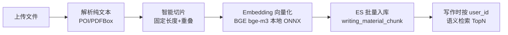
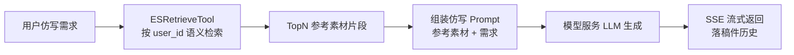

# 第4节：素材 RAG 管线 原理解析、实现与代码讲解

素材 RAG 管线是 ScriptAgent 能力二"素材文档仿写"的地基，也是整套系统最核心的自实现链路。这节讲四件事：素材 RAG 是什么、动手前该想清楚什么、代码怎么写、做完怎么验。它落在决策五（RAG 管线自实现）和 §9.3 模型选型上（Embedding = BGE bge-m3 **本地模型 + JVM 进程内 ONNX Runtime 推理**）。

---

## 一、素材 RAG 是什么，干嘛用的

一句话：把用户上传的文档切碎转成向量存进 ES，写作时按语义把最相关的片段捞回来喂给大模型当参考。

通俗例子：你要"照着公司年报风格写周报"，系统先把你之前传的年报切块、每块标好位置存进库（入库），写的时候把你这段需求拿进去比对，把最像年报的几段捞出来当参考（检索）。这样大模型写出来的东西有你的素材打底，而不是凭空发挥。

整套链路五步，一步都不能少：



---



## 二、动手前先想清楚几件事

### 第一，职责拆干净

链路每个环节都是成熟组件，但**组合逻辑要自己掌控**：

| 环节 | 谁 | 放哪 |
|------|-----|------|
| 解析（docx/pdf/txt/md） | `DocumentParser` | writing-storage |
| 切片（长度+重叠） | `ChunkSplitter` | writing-storage |
| 向量化（BGE 本地加载） | `EmbeddingClient` | writing-model |
| ES 入库/检索 | `MaterialChunkRepository` | writing-storage |
| 全链路编排 | `MaterialService` | writing-business |

### 第二，为什么自己写不用现成 RAG 框架

切片参数要能调、失败要能回退、检索要强制 user_id、删除要清 ES——这些组合逻辑用自己的代码串最清晰、最可控。每个环节仍是成熟组件（POI/PDFBox、ES、ONNX Runtime），不算重复造轮子。

### 第三，几个坑，提前想到

- **切片参数写死 → 召回质量没法调**。长度/重叠必须配 yml 可改。
- **ES 索引维度与 bge-m3 不一致 → 入库检索报错**。`embedding` 字段 `dense_vector` 的 `dim` 必须 = 1024，距离用 cosine。
- **向量化失败产生半成品 → 落半截数据**。任一步失败整体回退，不产生孤儿数据。
- **删除素材没清 ES → 孤儿向量残留**。按 material_id 同步清理切片。
- **检索漏 user_id → 越权拿到别人的素材片段**。检索强制带 user_id。

---

## 三、代码怎么写

### 主角一：DocumentParser（文档解析）

```java
@Component
@RequiredArgsConstructor
public class DocumentParser {

    public String parse(String fileName, InputStream in) {
        String ext = FilenameUtils.getExtension(fileName).toLowerCase();
        return switch (ext) {
            case "docx" -> new XWPFDocument(in).getParagraphs().stream()
                    .map(XWPFParagraph::getText).collect(joining("\n"));
            case "pdf"  -> extractPdf(in);            // PDFBox，含分页拼接
            case "txt", "md" -> new String(in.readAllBytes(), UTF_8);
            default -> throw new BusinessException(ErrorCode.UNSUPPORTED_FORMAT);
        };
    }
}
```

逐行解析：按扩展名分发到不同解析器；`docx` 用 POI 读段落、`pdf` 用 PDFBox 抽文本、`txt/md` 直接读；**不支持的格式直接抛明确错误**，不产生半成品。

### 主角二：ChunkSplitter（切片）

```java
@Component
public class ChunkSplitter {
    @Value("${rag.chunk.size:512}")
    private int chunkSize;
    @Value("${rag.chunk.overlap:50}")
    private int overlap;

    public List<Chunk> split(String text, long materialId) {
        List<Chunk> chunks = new ArrayList<>();
        for (int start = 0; start < text.length(); start += chunkSize - overlap) {
            int end = Math.min(start + chunkSize, text.length());
            chunks.add(new Chunk(materialId, chunks.size(), text.substring(start, end)));
            if (end == text.length()) break;
        }
        return chunks;
    }
}
```

要点：`start` 每次前进 `chunkSize - overlap`，保证相邻切片有重叠、语义不断裂；`chunkSize`/`overlap` 从 yml 读，可调优。

### 配角：EmbeddingClient（本地向量化，writing-model）

```java
@Component
public class EmbeddingClient {
    @Value("${model.embedding.model-path}")
    private String modelPath;          // 本地 bge-m3 模型目录（含 onnx/model.onnx）

    private OrtSession session;        // ONNX Runtime 会话，启动加载一次
    private BertTokenizer tokenizer;

    @PostConstruct
    void load() {                      // load-on-start，单例加载 2.3GB 模型
        session = OrtEnvironment.getEnvironment()
                .createSession(modelPath + "/onnx/model.onnx", new OrtSession.SessionOptions());
        tokenizer = BertTokenizer.fromPretrained(modelPath);
    }

    public float[] embed(String text) {
        // tokenizer 编码 → session.run 推理 → 输出归一化 1024 维向量
    }
}
```

要点：模型 ONNX 自带 Transformer+Pooling+Normalize，**输出即归一化 1024 维向量**，可直接做 cosine；`@PostConstruct` 启动加载一次，单例复用。

### 配角：MaterialChunkRepository（ES 入库/检索，writing-storage）

```java
public void batchUpsert(List<Chunk> chunks, float[][] vectors) { /* ES bulk 写入 */ }
public List<String> search(Long userId, float[] queryVector, int topK) {
    // ES knn 检索：must 加 user_id 条件，禁止召回他人素材
}
```

### 编排者：MaterialService（writing-business）

把上传→解析→切片→向量化→入库串起来，任一步失败抛错回退：

```java
@Transactional
public Long upload(Long userId, MultipartFile file) {
    String text = documentParser.parse(file.getOriginalFilename(), file.getInputStream());
    List<Chunk> chunks = chunkSplitter.split(text, materialId);
    float[][] vectors = chunks.stream().map(c -> embeddingClient.embed(c.getText())).toArray(...);
    materialChunkRepository.batchUpsert(chunks, vectors);
    return saveMaterialRecord(userId, file, text, chunks.size());   // MySQL 主记录
}
```

---

## 四、验收 harness

| 测试类 | 覆盖的验收点 |
|--------|-------------|
| `DocumentParserTest` | docx/pdf/txt/md 四种解析正确；坏文件/不支持格式报错且不落库 |
| `ChunkSplitterTest` | 固定长度+重叠切得对；空文档/短文档边界 |
| `MaterialChunkRepositoryTest` | ES 写入/检索正确；检索强制 user_id；删除按 material_id 清干净 |
| `MaterialServiceTest` | 上传全链路成功；向量化失败回退不产生半成品 |

最值钱的回归测试：

```java
@Test
void deleteMaterial_removesAllEsChunks() {
    materialService.delete(userA, materialId);
    assertTrue(materialChunkRepository.findByMaterialId(materialId).isEmpty());
    // 不清理 → 孤儿向量，后续搜索串数据
}

@Test
void search_carriesUserId_returnsOnlyOwnChunks() {
    materialChunkRepository.search(userB, vec, 5);   // 只应召回 userB 的素材
}
```

---

## 五、做完怎么验

harness 全绿后，人工确认：

1. 传一份真实 docx → 素材列表可见，ES 能按该用户搜到切片
2. 换另一个用户登录，检索不到前一个用户的任何片段
3. 删除素材后，ES 该 material_id 无残留
4. 传一份损坏 PDF → 明确报错，不落半截数据
