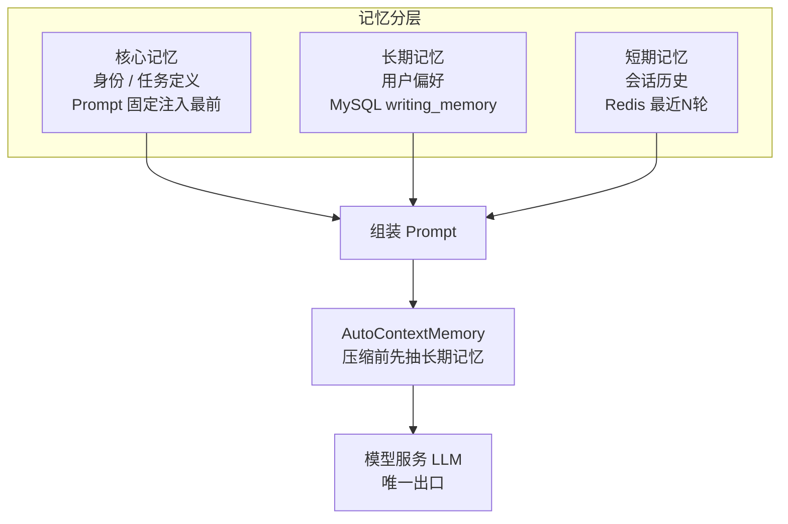

# 第5节：Agent 核心与记忆分层 原理解析、实现与代码讲解

Agent 核心模块（writing-agent-core）是 ScriptAgent 的 AI 能力底座，也是**核心重点模块**。这节讲四件事：Agent 核心是什么、动手前该想清楚什么、代码怎么写、做完怎么验。它落在决策一（Agent 无状态）、决策二（AgentScope 使用边界）、决策九（依赖模型服务）上，记忆分层（§5.2）是本节的硬骨头。

---

## 一、Agent 核心是什么，干嘛用的

一句话：Agent 核心全权封装 AgentScope2.0，把"生成一个能对话、能查素材、能按模板写的写作 Agent"这件事统一起来，三类写作共享这一套底座。

通俗例子：一个"写作工人"的调度台。它自己不写稿（不直接连大模型），而是按活（对话/仿写/模板）派不同的"工种"（Agent 配置），给每个工种配好记忆（会话/偏好/身份）、配好工具（ES 检索）、配好话术（Prompt），干活的时候统一打给"翻译官"（模型服务）去调大模型。

在整套系统里，Agent 核心是**三类写作能力共享的底座**——对话、仿写、模板全走同一套 Agent 工厂 + 记忆 + 工具 + Prompt + SSE 封装。

---



## 二、动手前先想清楚几件事

### 第一，职责拆干净（决策九是红线）

| 谁 | 负责 | 放哪 |
|----|------|------|
| `AgentFactory` | 按模式生成 Agent 配置 | writing-agent-core |
| `RedisMemory` | 短期会话记忆 → Redis | writing-agent-core |
| 长期记忆 | 用户偏好 → MySQL `writing_memory` | writing-agent-core |
| `ESRetrieveTool` | RAG 检索工具 → ES | writing-agent-core |
| Prompt 管理 | 三类 Prompt 隔离 | writing-agent-core |
| **模型服务（writing-model）** | **LLM/Embedding 唯一出口** | writing-model |

**红线**：AgentCore 在推理时**不直接连接任何大模型**，统一经模型服务（writing-model）发请求。换模型只改模型服务层，Agent 层无感。

### 第二，为什么 Agent 必须无状态（决策一）

写作 Agent 不持有任何会话状态。多轮上下文在 Redis、素材在 ES、业务数据在 MySQL。任意时刻生成一个新的 Agent 实例都能继续处理用户对话——因为没有状态在 Agent 内部。这是未来多实例水平扩展的前提。

### 第三，记忆为什么要分三层（§5.2，本节硬骨头）

| 层 | 存什么 | 存哪 | 注入时机 | 生命周期 |
|----|--------|------|---------|---------|
| **短期记忆（会话）** | 当前多轮对话历史 | Redis `session:{userId}:{sessionId}` | 每轮注入（最近 N 轮） | 随会话，TTL 过期 |
| **长期记忆（偏好）** | 用户写作偏好/风格/术语 | MySQL `writing_memory` | 每次对话开始注入 system prompt | 跨会话持久 |
| **核心记忆（身份）** | Agent 身份、任务定义、Prompt 骨架 | 代码/配置（Prompt 管理） | 每次调用固定注入最前面 | 只随代码/配置变 |

一句话：**核心记忆定"你是谁"，长期记忆记"用户是谁"，短期记忆装"这次聊了什么"**，压缩保证"聊得再长也不撑爆上下文"。

几个坑提前想到：

- **三层混成一层** → 长期偏好随会话丢失。跨轮要长期保持的指令（如"以后都写 800 字"）必须走 `save_memory` 进长期记忆，不能靠短期窗口。
- **短期记忆存中间态** → 冗余又危险。只存 `user` 输入 + `assistant` 最终回复，**丢弃 think/plan 和 tool 中间态**。
- **Agent 内部塞状态** → 无法扩展。状态必须外置。
- **压缩前不抽长期记忆** → 有价值信息随压缩丢失。AgentScope 官方强调的顺序是"先抽取长期记忆，再压缩短期记忆"。
- **AgentCore 直连大模型** → 换模型要改 Agent 层。必须经模型服务。

---

## 三、代码怎么写

### 模块分工表

| 类 | 职责 |
|----|------|
| `AgentFactory` | 按对话/仿写/模板生成 Agent 配置 |
| `RedisMemory` | 对接 AgentScope `MemoryBase`，落地 Redis |
| `LongTermMemoryService` | 对接 `LongTermMemoryBase`，读写 MySQL `writing_memory` |
| `ESRetrieveTool` | 对接 AgentScope 工具抽象，封装 ES 检索 |
| `PromptManager` | 三类 Prompt 组装、核心记忆固定注入 |
| `StreamingResponseHandler` | SSE 流式封装 + Redis 会话缓存 |

### 主角一：AgentFactory（无状态生成）

```java
@Component
@RequiredArgsConstructor
public class AgentFactory {

    public WritingAgent create(String mode, Long userId, String sessionId) {
        return switch (mode) {
            case "dialog"   -> dialogAgent(userId, sessionId);   // RedisMemory + LLM，无工具
            case "rag"      -> ragAgent(userId, sessionId);      // + ESRetrieveTool
            case "template" -> templateAgent(userId, sessionId); // 模板 Prompt
            default -> throw new IllegalArgumentException("未知写作模式: " + mode);
        };
    }
}
```

要点：每次请求按需生成，不持有会话状态；三种模式共享底座，只差 Agent 配置。

### 主角二：RedisMemory（短期会话记忆）

```java
public class RedisMemory implements MemoryBase {
    private static final String KEY = "session:{userId}:{sessionId}";

    public void append(String role, String content) {
        // Redis list 追加 {role, content}，只存对话层消息
    }

    public List<Map<String,String>> loadRecent(int maxRounds) {
        // 取最近 N 轮，超过窗口的最早轮次滑出
    }
}
```

**内容构成**：每条只有两个来源——`user` 输入和 `assistant` 最终回复，存成 `[{role, content}...]`。思考过程、tool 调用记录、检索到的参考素材**都不写入**。

### 配角：长期记忆 + ESRetrieveTool

```java
// 长期记忆：对话中识别稳定偏好，经 save_memory 工具写 MySQL writing_memory（按 user_id 隔离）
// 每次对话开始，按 user_id 加载 → 注入 system prompt；量大时按最新/高频截断

// ESRetrieveTool：封装 ES 检索，写作时按 user_id 语义检索相似切片 → 作为参考素材注入 Prompt
public String execute(String query) {
    Long userId = UserContext.get();                 // 强制带 user_id
    return String.join("\n", esRepo.search(userId, embed(query), topK));
}
```

### 编排者：WritingAgent（一次推理的编排）

```java
public class WritingAgent {
    public void run(Long userId, String sessionId, String userMessage, SseEmitter emitter) {
        String core = promptManager.core();            // 核心记忆，固定最前面
        List<String> longTerm = longTermMemory.load(userId);   // 长期记忆，对话开始注入
        List<Map<String,String>> recent = redisMemory.loadRecent(maxRounds); // 短期，最近 N 轮
        // 组装 prompt → 调模型服务 LLM → SSE 流式逐段推送 → 写 Redis 会话缓存
        // 超长时 AutoContextMemory 压缩：先抽取长期记忆，再压缩短期记忆
    }
}
```

---

## 四、验收 harness

Agent 核心层可全部 mock（模型服务、Redis、ES），单测秒级跑完。

| 测试类 | 覆盖的验收点 |
|--------|-------------|
| `AgentFactoryTest` | 三种模式生成正确配置；未知模式抛错 |
| `RedisMemoryTest` | 只存 user/assistant；超过 max-rounds 滑出；中间态不写入 |
| `LongTermMemoryServiceTest` | save_memory 写入；按 user_id 加载；user_id 隔离 |
| `PromptManagerTest` | 核心记忆排最前；三类 Prompt 隔离；长期记忆注入 |
| `WritingAgentTest` | 三模式都能产出；超长触发压缩且先抽长期记忆 |

最值钱的回归测试：

```java
@Test
void shortTermMemory_storesOnlyDialog_dropsIntermediate() {
    redisMemory.append("think", "先查素材再写");       // 思考过程，应被忽略
    redisMemory.append("user", "帮我写推文");
    redisMemory.append("assistant", "初稿如下…");
    assertEquals(2, redisMemory.loadRecent(10).size());   // 只有 user + assistant
}

@Test
void longContext_extractsLongTermBeforeCompress() {
    when(llm.summarize(any())).thenReturn("摘要");
    writingAgent.run(userId, sessionId, msg, emitter);
    verify(longTermMemory).save(any());   // 压缩前先落长期记忆
}
```

---

## 五、做完怎么验

harness 全绿后，人工确认：

1. 三种写作模式都能调 LLM 产出文稿，SSE 流式
2. 让模型"以后都写 800 字"，下个会话它还记得（长期记忆生效）
3. 一个会话聊很久，观察短期记忆只留最近 10 轮，不撑爆
4. 换模型只改模型服务层，Agent 层代码不动
