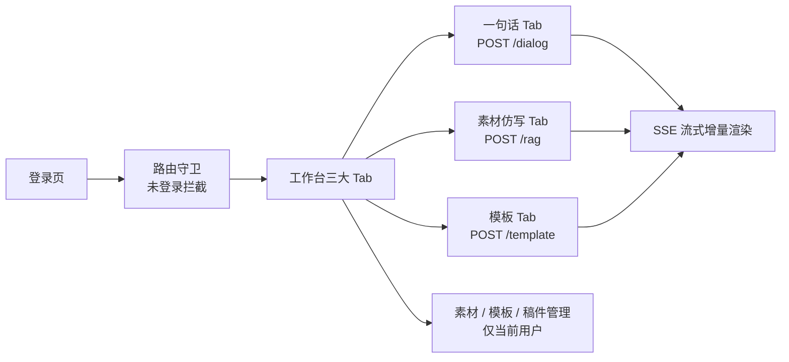

# 第7节：前端工作台 原理解析、实现与代码讲解

前端工作台是 ScriptAgent 的交互层，用户所有写作都在这完成。这节讲四件事：前端工作台是什么、动手前该想清楚什么、代码怎么写、做完怎么验。技术栈 Vue3 + Vite + Element Plus + Pinia + Axios + SSE（§10）。

---

## 一、前端工作台是什么，干嘛用的

一句话：一个单页面 Tab 工作台，把登录、三大写作、素材管理、模板管理、稿件历史收进一个页面，用 SSE 实时渲染大模型流式输出的文稿。

通俗例子：一个"写作工位"。左边是三大工作台（对话/仿写/模板），右边是素材柜、模板柜、历史档案。你在这写、存、翻，一个地方搞定今天所有要写的东西。

在整套系统里，前端是三类核心写作 + 四类支撑能力的统一入口：`writing-api` 的所有端点都从工作台调起。

---



## 二、动手前先想清楚几件事

### 第一，页面模块

| 模块 | 说明 |
|------|------|
| 登录模块 | 账号密码、存 Token、路由守卫 |
| 核心工作台（三大 Tab） | 一句话多轮、素材仿写、模板写作 |
| 素材管理 | 上传、列表、预览、删除 |
| 模板管理 | 新增、编辑、启用停用、变量配置 |
| 稿件历史 | 记录、重新编辑、导出 Word、删除 |

### 第二，为什么 SSE 而不是轮询/WebSocket

长文生成体验的关键是**增量渲染**：SSE（EventSource / fetch stream）逐段推送，前端实时显示，用户不用等全文出完。配合 Redis 缓存支持断线恢复。

### 第三，几个坑，提前想到

- **Token 失效不清** → 所有请求 401 卡死。Axios 拦截器统一带 Token，401 跳登录。
- **未登录访问业务页** → 空页面。路由守卫拦截。
- **SSE 渲染卡顿** → 大段内容一次性刷。要增量追加，别整段替换。
- **登录接口也带拦截** → 永远 401。登录接口要放行。
- **三个 Tab 状态混乱** → 用 Pinia 统一管理，别各组件自存。

---

## 三、代码怎么写

### 模块分工表

| 文件 | 职责 |
|------|------|
| `router/index.js` | 路由 + 守卫 |
| `api/*.js` | Axios 封装（统一 Token + 401 处理） |
| `stores/user.js` / `stores/workbench.js` | Pinia 状态 |
| `views/Login.vue` | 登录页 |
| `views/Workbench.vue` | 三大 Tab 工作台 |
| `components/SseStream.vue` | SSE 流式渲染 |

### 主角一：Axios 拦截器（统一 Token + 401）

```js
// api/http.js
axios.interceptors.request.use(config => {
  const token = localStorage.getItem('token');
  if (token) config.headers.Authorization = token;   // 统一带 Token
  return config;
});
axios.interceptors.response.use(
  resp => resp,
  error => {
    if (error.response?.status === 401) {
      router.push('/login');                          // 401 → 跳登录
    }
    return Promise.reject(error);
  }
);
```

要点：Token 统一在请求拦截器携带，业务代码不用每个请求手动带；401 全局跳登录。

### 主角二：SSE 流式渲染

```vue
<!-- components/SseStream.vue -->
<script setup>
import { ref } from 'vue';
const content = ref('');

export function startStream(url, params) {
  const es = new EventSource(url + '?token=' + localStorage.getItem('token'));
  es.onmessage = (e) => {
    content.value += e.data;          // 增量追加，不整段替换
  };
  es.onerror = () => es.close();      // 断线关闭，可重连
}
</script>
```

要点：`content.value += e.data` **增量追加**，大模型逐段吐字实时上屏；断线时关闭可重连，Redis 缓存兜底恢复。

### 主角三：三大 Tab 工作台（Vue3）

```vue
<el-tabs v-model="activeTab">
  <el-tab-pane label="一句话写作" name="dialog">
    <!-- 输入一句话 → POST /api/writing/dialog → SseStream 渲染 -->
  </el-tab-pane>
  <el-tab-pane label="素材仿写" name="rag">
    <!-- 选素材 + 输入需求 → POST /api/writing/rag -->
  </el-tab-pane>
  <el-tab-pane label="模板写作" name="template">
    <!-- 选模板 → 按 variables 动态生成表单 → POST /api/writing/template -->
  </el-tab-pane>
</el-tabs>
```

### 配角：路由守卫

```js
router.beforeEach((to) => {
  if (to.path !== '/login' && !localStorage.getItem('token')) {
    return '/login';                  // 未登录拦截
  }
});
```

---

## 四、验收 harness（前端冒烟 + 联调）

| 场景 | 覆盖点 |
|------|--------|
| 登录冒烟 | 账号密码登录拿 Token；路由守卫拦截未登录 |
| 三大 Tab 冒烟 | 对话/仿写/模板各走通一次，SSE 实时渲染 |
| 素材管理冒烟 | 上传、列表、预览、删除 |
| 模板管理冒烟 | 新建模板动态表单、启用停用 |
| 稿件历史冒烟 | 记录、重新编辑、导出 Word |

最值钱的联调回归（方法名英文、与功能符合）：

```js
// routerGuard_blocksUnauthenticated_redirectsToLogin
// tokenExpired_anyRequest401_redirectsToLogin
// sseStream_appendsIncrementally_notFullReplace
```

---

## 五、做完怎么验

冒烟全绿后，人工确认：

1. 全新浏览器未登录，直接访问工作台 → 跳登录页
2. 登录后三大 Tab 各写一篇，SSE 实时吐字、无卡顿
3. 素材/模板/稿件管理全流程可操作，仅当前用户数据
4. 长文生成中途断网，重连后从 Redis 缓存续上
