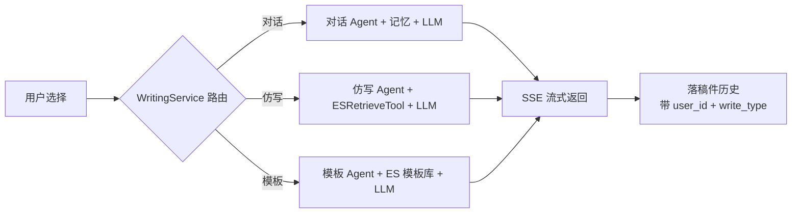

# 第8节：三类写作编排 原理解析、实现与代码讲解

写作业务编排（writing-business）是 ScriptAgent 的核心编排层。这节讲四件事：写作编排是什么、动手前该想清楚什么、代码怎么写、做完怎么验。它不碰底层存储、不碰 Agent 底层，只做**路由与协调**。

---

## 一、写作编排是什么，干嘛用的

一句话：根据用户选哪种写作方式，把请求路由到对应的 Agent 和流程上，协调记忆、工具、模型、存储把一次写作跑完。

通俗例子：餐厅的前台。客人点三种套餐（对话/仿写/模板），前台按单派给对应后厨（Agent），后厨用料（素材/模板）、按菜谱（Prompt）、上菜（SSE 流式），吃完了记一单（稿件历史）。前台自己不炒菜，但所有人都找它点单。

在整套系统里，写作编排把三类写作能力、四类支撑能力（素材/模板/稿件）串成一个入口，是 `writing-api` 与 `writing-agent-core`/`writing-storage`/`writing-model` 之间的调度中枢。

---



## 二、动手前先想清楚几件事

### 第一，三类写作共享一套底座

不是三个独立系统，只差 Agent 配置和依赖：

| 模式 | 入口 | 依赖 |
|------|------|------|
| 对话写作 | Tab1 一句话 | AgentCore 对话 Agent + 记忆 + 模型服务（LLM），无 ES |
| 素材仿写 | Tab2 素材 + 需求 | AgentCore 仿写 Agent + 记忆 + ESRetrieveTool + 模型服务（LLM） |
| 模板写作 | Tab3 模板 + 参数 | AgentCore 模板 Agent + 记忆 + ES 模板库 + 模型服务（LLM） |

### 第二，编排层不越界

写作编排**只做路由与协调**：不碰底层存储实现（那是 writing-storage）、不碰 Agent 内部（那是 writing-agent-core）、不直连模型（那是 writing-model）。这样每一层都可单独替换、测试。

### 第三，几个坑，提前想到

- **路由到错误模式** → 写错类别的稿。路由用枚举/switch 明确，别靠字符串散拼。
- **仿写漏 ES 检索** → 参考素材没注入，写成"凭空发挥"。仿写必须带 ESRetrieveTool。
- **SSE 断线丢内容** → 流式内容要写 Redis 缓存，支持断线恢复。
- **稿件保存漏 user_id / 写模式** → 历史查不准、隔离失效。统一入口保存，带 user_id + write_type。
- **模板填参校验遗漏** → 必填项缺失就生成，产出残缺稿。渲染前校验 variables 必填项。

---

## 三、代码怎么写

### 模块分工表

| 类 | 职责 |
|----|------|
| `WritingService` | 写作路由（入口） |
| `MaterialService` | 素材业务（解析调度/切片/ES 入库/删除清 ES） |
| `TemplateService` | 模板业务（渲染/变量填充/Prompt 组装） |
| `ArticleService` | 稿件历史（保存/查询/重新编辑/导出 Word） |
| `SseStreamingService` | SSE 流式封装 + Redis 缓存 |

### 主角：WritingService（写作路由）

```java
@RestController
@RequestMapping("/api/writing")
@RequiredArgsConstructor
public class WritingService {

    private final AgentFactory agentFactory;
    private final SseStreamingService sse;

    @PostMapping("/dialog")      // 一句话多轮对话
    public SseEmitter dialog(@RequestBody DialogReq req) {
        Long userId = UserContext.get();
        String sessionId = UUID.randomUUID().toString();
        WritingAgent agent = agentFactory.create("dialog", userId, sessionId);
        return sse.stream(emitter -> agent.run(userId, sessionId, req.getContent(), emitter));
    }

    @PostMapping("/rag")         // 素材仿写
    public SseEmitter rag(@RequestBody RagReq req) {
        Long userId = UserContext.get();
        WritingAgent agent = agentFactory.create("rag", userId, req.getSessionId());
        // AgentScope 会调 ESRetrieveTool 按 user_id 检索参考素材 → 注入仿写 Prompt
        return sse.stream(emitter -> agent.run(userId, sessionId, req.getRequirement(), emitter));
    }

    @PostMapping("/template")    // 模板写作
    public SseEmitter template(@RequestBody TemplateReq req) {
        Long userId = UserContext.get();
        WritingAgent agent = agentFactory.create("template", userId, req.getSessionId());
        return sse.stream(emitter -> agent.run(userId, sessionId, req.getParams().toString(), emitter));
    }
}
```

逐行解析：三个入口都从 `UserContext.get()` 取 user_id（不从前端参数取）；都走 `AgentFactory` 按模式生成 Agent；都经 `SseStreamingService` 统一流式返回；`/rag` 的参考素材由 Agent 内部的 ESRetrieveTool 检索注入。

### 配角：ArticleService（稿件历史统一入口）

```java
@Transactional
public Long save(Long userId, String writeType, String title, String content,
                 Long materialId, Long templateId) {
    // 三类写作统一走这里落稿：带 user_id + write_type
    // 分页查询仅当前用户；重新编辑 = 把历史稿件作为上下文继续迭代；导出 Word 用 POI 生成 docx
}
```

### 编排：一个 SSE 流式封装的骨架

```java
public SseEmitter stream(Consumer<SseEmitter> task) {
    SseEmitter emitter = new SseEmitter(0L);            // 不设超时，长文生成
    task.accept(emitter);
    return emitter;                                     // 逐段 onNext 推送 + 写 Redis 缓存
}
```

---

## 四、验收 harness

编排层 mock Agent/存储/模型，重点测路由与协调。

| 测试类 | 覆盖的验收点 |
|--------|-------------|
| `WritingServiceTest` | 三模式路由到正确 Agent；未知模式拒绝 |
| `TemplateServiceTest` | 变量填充正确；必填项缺失校验；Prompt 组装含模板正文 |
| `ArticleServiceTest` | 保存带 user_id+write_type；查询仅当前用户；重新编辑上下文正确 |
| `SseStreamingServiceTest` | 流式逐段推送；内容写 Redis 缓存；断线可恢复 |

最值钱的回归测试：

```java
@Test
void ragAgent_hasEsRetrieveTool_injectsReference() {
    WritingAgent agent = agentFactory.create("rag", userA, sessionId);
    verify(agent).setTool("esRetrieve");     // 仿写 Agent 必须挂检索工具
    // 无工具 → 参考素材没注入 → 写成"凭空发挥"
}

@Test
void articleSave_carriesUserIdAndWriteType() {
    articleService.save(userA, "rag", ...);
    var list = articleService.queryByUser(userA);
    assertTrue(list.stream().allMatch(a -> a.getWriteType().equals("rag")));
}
```

---

## 五、做完怎么验

harness 全绿后，人工确认：

1. 前端三个 Tab 分别走通对话/仿写/模板，SSE 实时渲染
2. 仿写时确认 ES 检索到了参考素材并注入
3. 稿件历史只显示当前用户的记录，且标注了写作文式
4. 断网重连后，SSE 内容能从 Redis 缓存恢复
