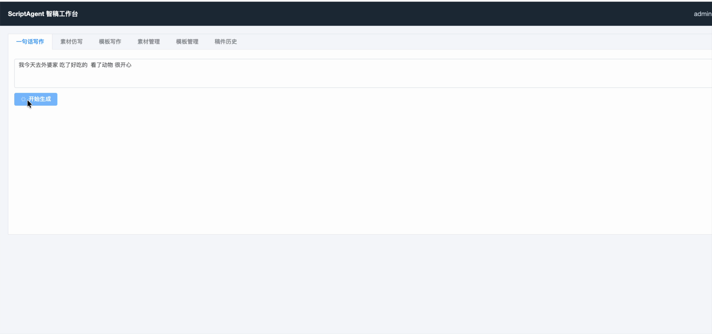
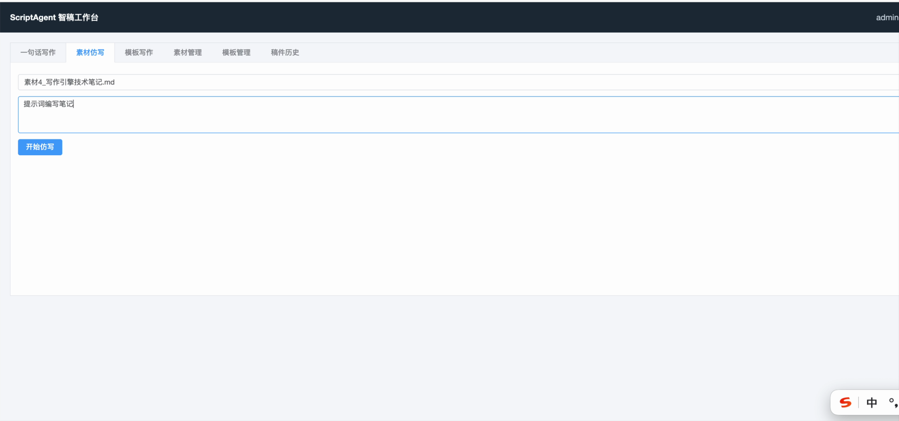
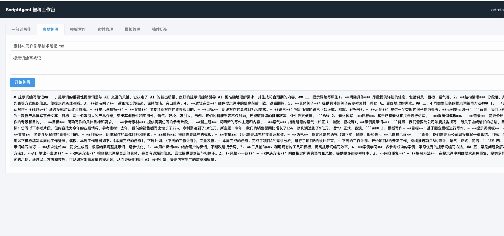
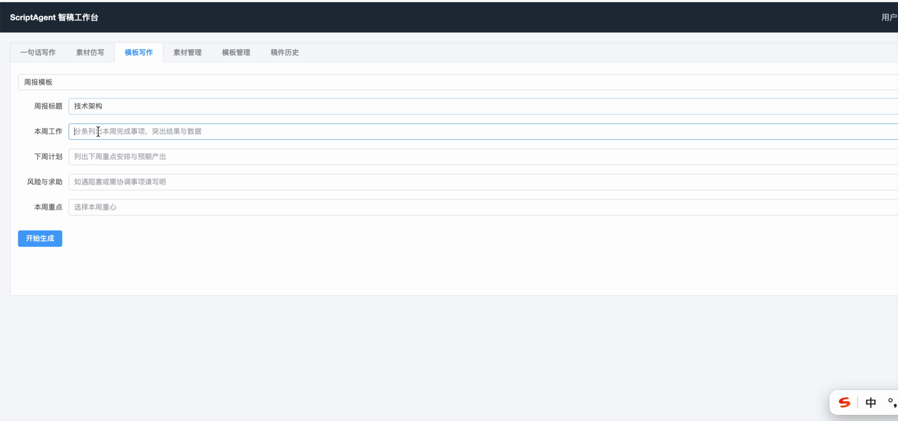
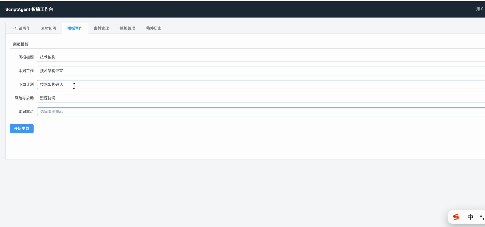
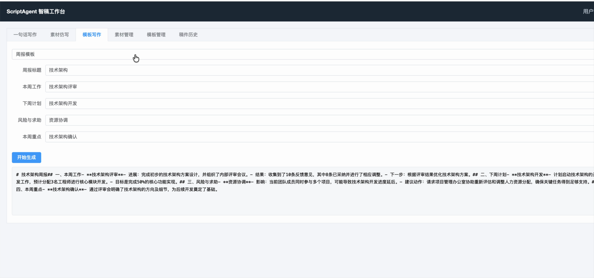
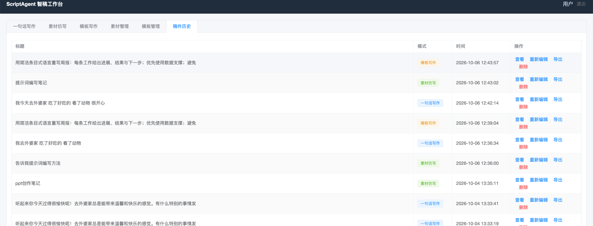

# ScriptAgent 智稿引擎 · 操作手册

> 面向最终用户的使用指南：从登录到产出稿件，覆盖三种写作模式的完整操作流程。
>
> 完整演示视频见 [`docs/操作视频.mov`](操作视频.mov)。

---

## 一、系统简介

ScriptAgent（智稿引擎）是一套企业级 AI 写作中台，提供三种写作能力：

| 模式                   | 适用场景               | 一句话描述                                |
| ---------------------- | ---------------------- | ----------------------------------------- |
| 💬**一句话写作** | 随笔、短文、快速生成   | 输入一句话想法，AI 多轮对话帮你写成稿     |
| 📄**素材仿写**   | 基于已有文档/报告仿写  | 上传素材文档，AI 参考其风格写出新主题文章 |
| 📋**模板写作**   | 周报、报告、标准化文档 | 选模板填表单，AI 按固定结构生成           |

---

## 二、登录

打开系统后进入登录页：

1. 输入用户名和密码
2. 点击「登录」
3. 登录成功后自动跳转到工作台首页

> 登录态有效期内免登录；超时后自动退回登录页。

---

## 三、工作台总览

登录后进入工作台，顶部为导航栏，包含 **6 个 Tab**：

| Tab        | 功能                           |
| ---------- | ------------------------------ |
| 一句话写作 | 多轮对话式写作                 |
| 素材仿写   | 上传素材 + 仿写要求，RAG 生成  |
| 模板写作   | 选模板 + 填动态表单生成        |
| 素材管理   | 上传、查看、删除素材文档       |
| 模板管理   | 查看可用模板                   |
| 稿件历史   | 查看、编辑、导出、删除历史稿件 |

---

## 四、一句话写作

### 操作步骤

1. 点击「一句话写作」Tab
2. 在输入框中输入写作想法，例如：

   > 我今天去外婆家 吃了好吃的 看了动物 很开心
   >
3. 点击蓝色「开始生成」按钮
4. AI 会流式输出初稿（逐字渲染，无需等待）
5. 如需修改，可继续在输入框补充要求（如"写得正式一点""加个结尾"），继续对话迭代

### 操作要点

- 输入越具体，输出越贴合预期
- 支持多轮对话：每次补充要求，AI 会在上下文基础上继续优化
- 生成过程中可随时停止，已生成内容会保留

---

## 五、素材仿写

### 操作步骤

1. 点击「素材仿写」Tab
2. 在素材选择框中，从已上传的素材文档里选一个（需先在「素材管理」上传）
3. 在写作要求输入框中输入仿写主题，例如：

   > 提示词编写笔记
   >
4. 点击「开始仿写」
5. 系统会：解析选中素材 → 切片向量化 → 检索相关片段 → 注入提示词 → 流式生成仿写稿

### 操作要点

- 素材支持格式：`.docx` / `.pdf` / `.txt` / `.md`
- 仿写不是逐句照抄，而是提取素材的句式、结构、语气风格，套用到新主题
- 参考素材越多，仿写风格越贴近
- 生成内容中可看到参考素材来源片段（如有需要）

---

## 六、模板写作

### 操作步骤

1. 点击「模板写作」Tab
2. 选择一个模板（如「周报模板」）
3. 系统会根据模板自动生成动态表单，填写各字段：

   

   - 周报标题：如「技术架构」
   - 本周工作：如「技术架构评审」
   - 下周计划：如「技术架构开发」
   - 风险与求助：如「资源协调」
   - 本周重点：如「技术架构确认」

   
4. 点击「开始生成」
5. AI 会按模板结构生成完整稿件

### 操作要点

- 不同模板对应不同的表单字段（模板由管理员配置）
- 带 `*` 的字段为必填
- 生成结果可在「稿件历史」中查看和导出

---

## 七、素材管理

在「素材管理」Tab 中：

- **上传素材**：选择本地 `.docx` / `.pdf` / `.txt` / `.md` 文件上传
- **素材列表**：查看已上传的素材（文件名、上传时间、切片数量）
- **删除素材**：删除后同步清理关联的向量索引数据

> 上传后系统自动完成：文档解析 → 文本切片（512 字 + 50 字重叠）→ 向量化 → 存入检索索引，无需人工处理。

---

## 八、模板管理

在「模板管理」Tab 中查看系统内置的写作模板，包括模板名称、用途说明和可用变量。

模板由管理员在后台配置，用户只能在「模板写作」中选择使用。

---

## 九、稿件历史

在「稿件历史」Tab 中查看所有生成过的稿件：

每条稿件操作：

| 操作     | 说明                               |
| -------- | ---------------------------------- |
| 查看     | 查看稿件完整内容                   |
| 重新编辑 | 基于已有稿件继续修改               |
| 导出     | 导出为 Word（.docx）格式下载到本地 |
| 删除     | 删除稿件（逻辑删除，不可恢复）     |

---

## 十、常见问题

**Q：生成速度慢怎么办？**
A：长文生成需要一定时间，系统采用 SSE 流式输出，逐字渲染，无需干等。如长时间无响应，检查网络和模型服务状态。

**Q：仿写结果和素材风格不一致？**
A：尝试在写作要求中明确风格要求（如"正式、客观、数据导向"），或上传更多参考素材。

**Q：上传的素材不显示？**
A：确认文件格式为 docx/pdf/txt/md；上传后系统需几秒处理（解析+切片+向量化），稍等刷新即可。

**Q：生成的稿件存在哪？**
A：所有稿件自动保存在「稿件历史」中，登录后随时可查看和导出。

---

## 相关文档

- [项目 README](../README.md) — 项目概览与技术架构
- [技术方案](TechnicalSolution.md) — 系统设计详细说明
- [操作视频](操作视频.mov) — 完整功能演示视频
